什麼是多端全螢幕適配？多端是多樣性的終端，像手機、平板或電腦等設備，全部螢幕的解析度都可以適配。

全螢幕適配方案中，Reponsive Web Design (RWD) 自適應網頁設計是最早提出來的解決方案之一。

<!-- more -->

與後來廣泛使用的 REM 方案，最大的不同是，雖然一樣是一套樣式代碼適配全部裝置，但其實 REM 方案只能適配單一樣的終端排版。

如京東的網站，有圖片比例不對、間隔過大等問題

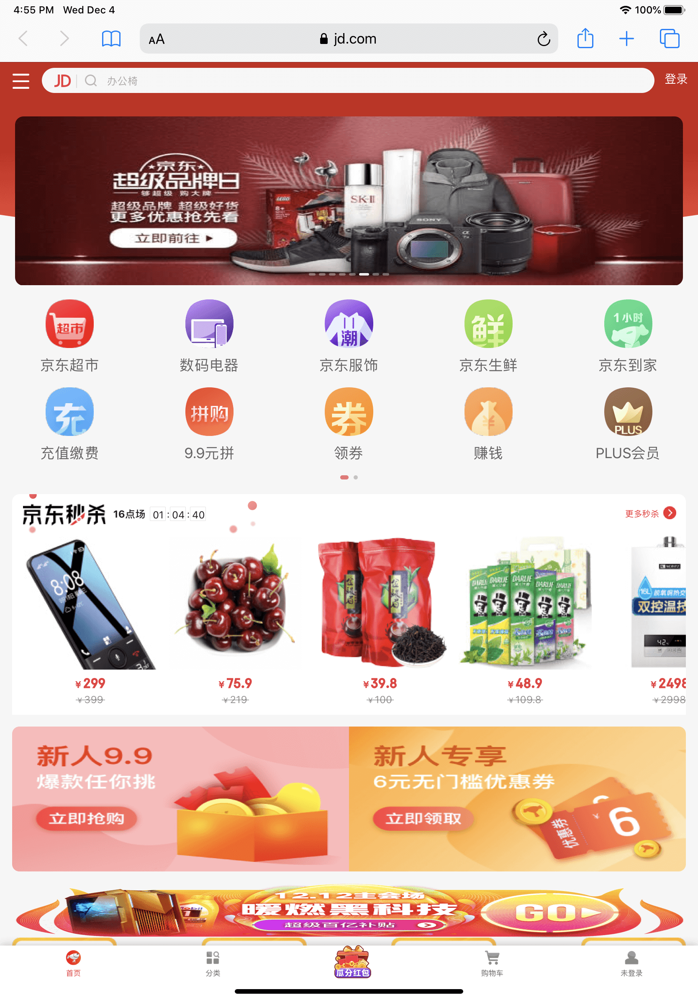

網易新聞，有過度放大、缺乏空間利用等問題

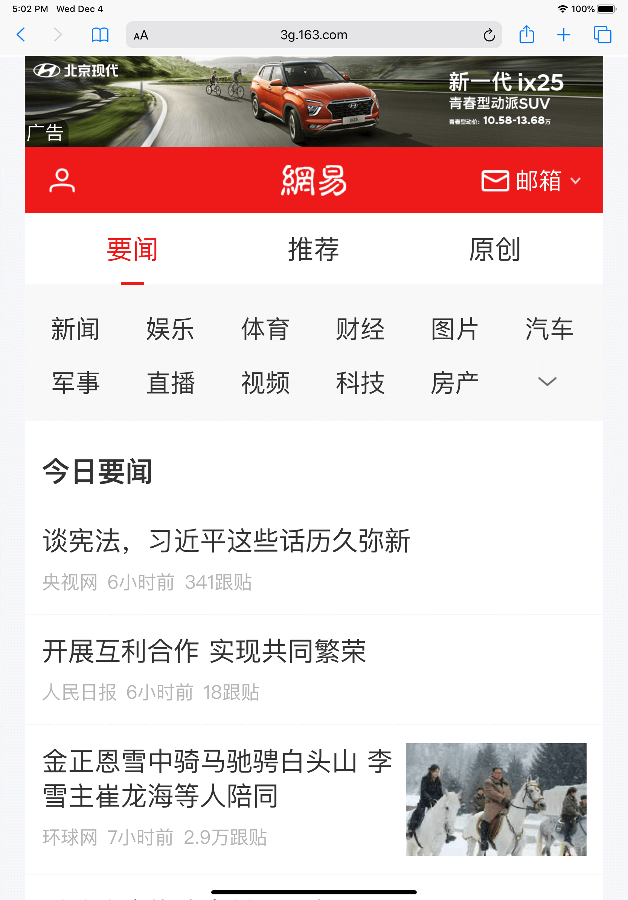

在開發 [騰訊微加信用卡官網](https://wepluscard.qq.com/mdft/index.shtml) 的網站時，為了滿足多端全螢幕適配的需求，調查現在幾個比較熱門支持自適應的 UI 框架

<div class="table-container">
  <table>
    <thead>
      <tr>
        <th>框架</th>
        <th>發佈於</th>
        <th>Stars on Github</th>
        <th>網站流量</th>
        <th>CSS.min</th>
        <th>JS.min</th>
      </tr>
    </thead>
    <tbody>
      <tr>
        <td>Bootstrap</td>
        <td>2011</td>
        <td>137K</td>
        <td>11.4M</td>
        <td>137 KB</td>
        <td>49.8 KB</td>
      </tr>
      <tr>
        <td>Semantic UI</td>
        <td>2013</td>
        <td>46.9K</td>
        <td>660.45K</td>
        <td>629 KB</td>
        <td>276 KB</td>
      </tr>
      <tr>
        <td>Foundation</td>
        <td>2011</td>
        <td>28.4K</td>
        <td>334.77K</td>
        <td>114 KB</td>
        <td>145 KB</td>
      </tr>
      <tr>
        <td>Bulma</td>
        <td>2016</td>
        <td>37.6K</td>
        <td>569.15K</td>
        <td>155 KB</td>
        <td>No JS</td>
      </tr>
    </tbody>
  </table>
</div>

> 網站流量數據來自 SimilarWeb

Bootstrap 無疑是最熱門且發展最久的 UI 框架之一

官方也有提供詳細的說明文檔

所以選擇 Bootstrap 當成微加信用卡官網的 UI 框架基礎

會吃魚，也要學怎麼釣魚。

我們還是要拆解一下，Bootstrap 到底主要做了哪些工作實現了自適應的。

## 設備分類

深入了解多端適配方案，首先要做的是將各種類設備的螢幕解析度分類

如 Bootstrap 對設備與解析度的分類

- 極小設備 - 低於576像素
- 小設備 - 576像素以上
- 中設備 - 768像素以上
- 大設備 - 992像素以上
- 極大設備 - 1200像素以上

把分類集轉義成 CSS 的媒體查詢代碼

如果選擇，移動端優先 (mobile first) 適配

```css
// Extra small devices (portrait phones, less than 576px)
// No media query for `xs` since this is the default in Bootstrap

// Small devices (landscape phones, 576px and up)
@media (min-width: 576px) { ... }

// Medium devices (tablets, 768px and up)
@media (min-width: 768px) { ... }

// Large devices (desktops, 992px and up)
@media (min-width: 992px) { ... }

// Extra large devices (large desktops, 1200px and up)
@media (min-width: 1200px) { ... }
```

反向為非移動端優先

```css
// Extra small devices (portrait phones, less than 576px)
@media (max-width: 575.98px) { ... }

// Small devices (landscape phones, less than 768px)
@media (max-width: 767.98px) { ... }

// Medium devices (tablets, less than 992px)
@media (max-width: 991.98px) { ... }

// Large devices (desktops, less than 1200px)
@media (max-width: 1199.98px) { ... }

// Extra large devices (large desktops)
// No media query since the extra-large breakpoint has no upper bound on its width
```

有人會想，現在的手機或平板的解析度比電腦高，這樣分有效嗎？

雖然移動端的解析度高，但實際螢幕的物理寬度並沒有比電腦大，只是讓同一張圖上用更多的像素點去畫出來。

所以要看的是設備的可視區域 (viewport) 像素，CSS 的媒體查詢也是依此為基準。

分倍率和像素的關係稱為像素密度 (pixel density)


> Pixel density - Material Design

| 裝置               | 分倍率<br>(像素)  | viewport<br>(像素) |
| ------------------ | ------------ | ---------- |
| 華為 P30 Pro       | 1080 x 2340  | 360 x 780   |
| iPhone Xs/11 Pro   | 1125 x 2436 | 375 x 812   |
| iPad 10.2(2019)    | 1620 x 2160 | 810 x 1080  |
| iPad Pro 11"       | 1668 x 2388 | 834 x 1194  |
| iPad Pro 12.9"     | 2048 x 2732 | 1024 x 1366 |

## 排版柵格

決定解析度和設備的分類後，接下來要考慮的是頁面的切分

排版主要會分成：

1. Columns - 列
2. Gutter - 列與列的間隔
3. Margin - 主要容器與頁面邊界間距


Bootstrap 和 Material Design 默認都是最大設備下一行 (col) 切分成 12 列 (col) 為單位

row 外層再用一個會根據不同尺寸的設備改變寬度的容器 (container) 包裹著 row，達成 col 有自適應的效果

所以容器寬度和設備尺寸的分類相互關連

container 寬度在各尺寸設備下

- 小設備(576px以上) - 左右 margin 各18px(共36px)，container 寬度 540px
- 中設備(768px以上) - 左右 margin 各24px(共48px)，container 寬度 720px
- 大設備(992px以上) - 左右 margin 各16px(共32px)，container 寬度 960px
- 極大設備(1200px以上) - 左右 margin 各30px(共60px)，container 寬度 1140px

小設備、中設備、大設備、極大設備分別代表 sm, md, lg, xl 等縮寫，應用到頁面的排版中

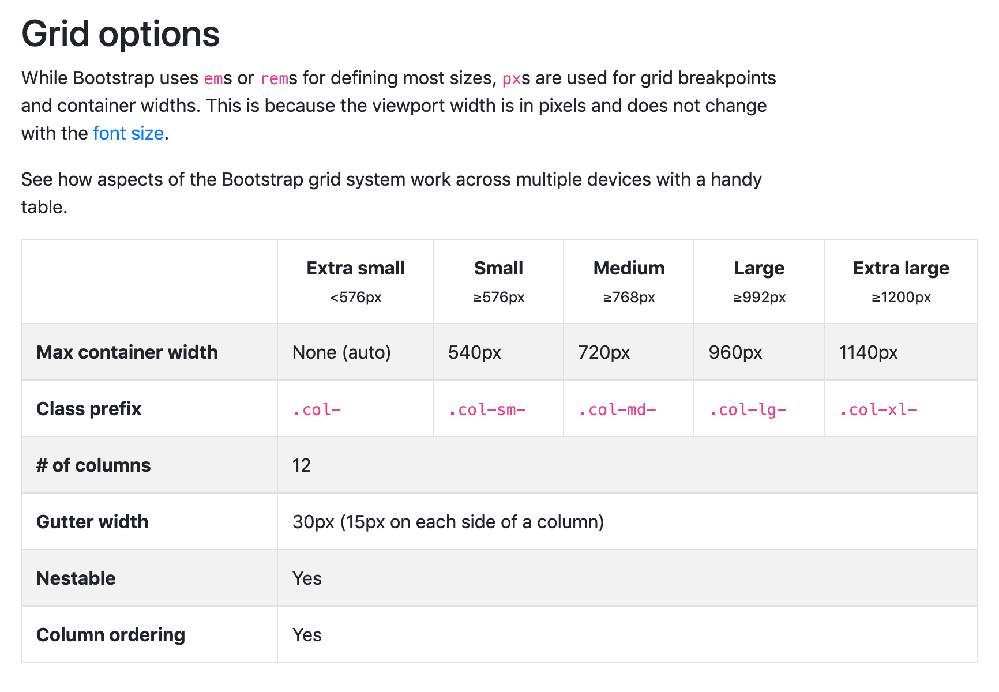

### 寬度均分

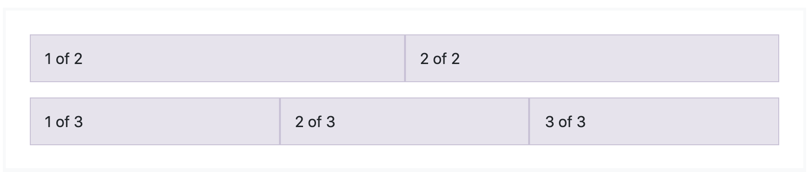

```html
<div class="container">
  <div class="row">
    <!-- 12 等份寬度中的 1/2 -->
    <div class="col">
      1 of 2
    </div>
    <!-- 12 等份寬度中的 1/2 -->
    <div class="col">
      2 of 2
    </div>
  </div>
  <div class="row">
    <!-- 12 等份寬度中的 1/3  -->
    <div class="col">
      1 of 3
    </div>
    <!-- 12 等份寬度中的 1/3 -->
    <div class="col">
      2 of 3
    </div>
    <!-- 12 等份寬度中的 1/3 -->
    <div class="col">
      3 of 3
    </div>
  </div>
</div>
```

### 某一列比較寬

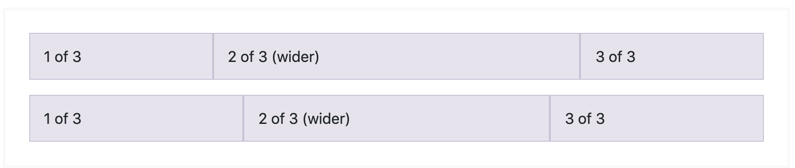

```html
<div class="container">
  <div class="row">
    <!-- 扣除 6/12 等份寬度，均分剩餘寬度 -->
    <div class="col">
      1 of 3
    </div>
    <!-- 佔 6/12 等份寬度 -->
    <div class="col-6">
      2 of 3 (wider)
    </div>
    <!-- 扣除 6/12 等份寬度，均分剩餘寬度 -->
    <div class="col">
      3 of 3
    </div>
  </div>
  <div class="row">
    <!-- 扣除 5/12 等份寬度，均分剩餘寬度 -->
    <div class="col">
      1 of 3
    </div>
    <!-- 佔 5/12 等份寬度 -->
    <div class="col-5">
      2 of 3 (wider)
    </div>
    <!-- 扣除 5/12 等份寬度，均分剩餘寬度 -->
    <div class="col">
      3 of 3
    </div>
  </div>
</div>
```

如果在設備分倍率較小的情況下，一個 row 無法放下這麼多列的內容時，可以加上 `col-<SIZE_OF_SCREEN>` 屏幕尺寸的前綴

```html
<div class="container">
    <div class="row">
        <!-- 其他尺寸下佔6格，均分12等份的column -->
        <!--
            大設備以上尺寸佔 3 格
            所以一行可以放 4 個 <div class="advantage-item"></div> (3/12 + 3/12 + 3/12 + 3/12 = 1)
        -->
        <!--
            在低於大屏的尺寸寬度，一個 advantage-item 佔 6 格
            所以一行只能放 2 個 <div class="advantage-item"></div> (6/12 + 6/12)
            如果超過二個，第三個就會自動換行並置左貼齊，後面以此類推
        -->
        <div class="col-6 col-lg-3">
            <div class="advantage-item">
                <div class="advantage-icon advt-1"></div>
                <div class="advantage-title">加速度</div>
                <div class="advantage-desc"><p>线上便捷申卡</p><p>审核最快5分钟完成</p></div>
            </div>

        </div>
        <div class="col-6 col-lg-3">
            <div class="advantage-item">...</div>
        </div>
        ...
    </div>
</div>
```

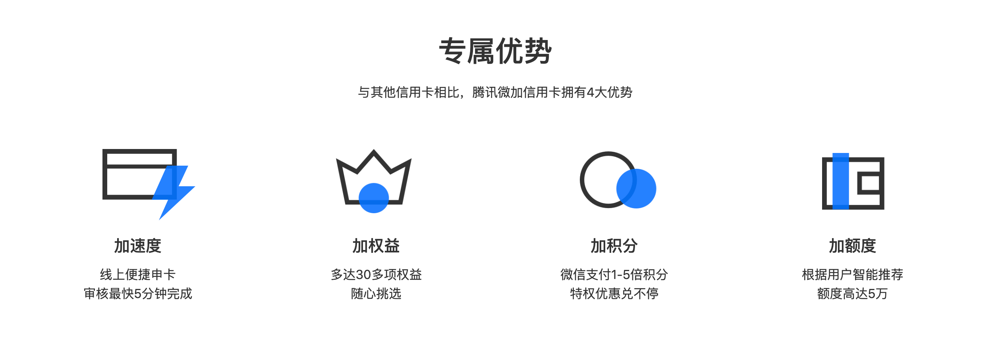


## 自定義

上面提到的不管是一行幾列、列與列的間隔 (gutter)、設備分類 (media query grid breakpoint)、容器寬度 (container & margin) 等

都可以依照項目的設計需求修改，透過原始碼的 `scss/_variables.scss` 文件變量，重新構建樣式代碼

```scss
// Grid breakpoints
$grid-breakpoints: (
  xs: 0, // 低於 576 像素，默認 0
  sm: 576px, // 小設備 - 576 像素以上
  md: 768px, // 中設備 - 768 像素以上
  lg: 992px, // 大設備 - 992 像素以上
  xl: 1200px // 極大設備 - 1200 像素以上
) !default;

// Grid containers
$container-max-widths: (
  sm: 540px, // 小設備時 container 寬度 (左右 margin 各18px，共36px)
  md: 720px, // 中設備時 container 寬度 (左右 margin 各24px，共48px)
  lg: 960px, // 大設備時 container 寬度 (左右 margin 各16px，共32px)
  xl: 1140px // 極大設備時 container 寬度 (左右 margin 各30px，共60px)
) !default;

// Grid columns
$grid-columns:                12 !default;  // 一行最多幾單位的 col
$grid-gutter-width:           30px !default; // 列與列間隔
```

現在也有很方便的線上配置網站，設定完直接幫你導出成一個樣式文件

- [Bootstrap Build](https://bootstrap.build/app)

  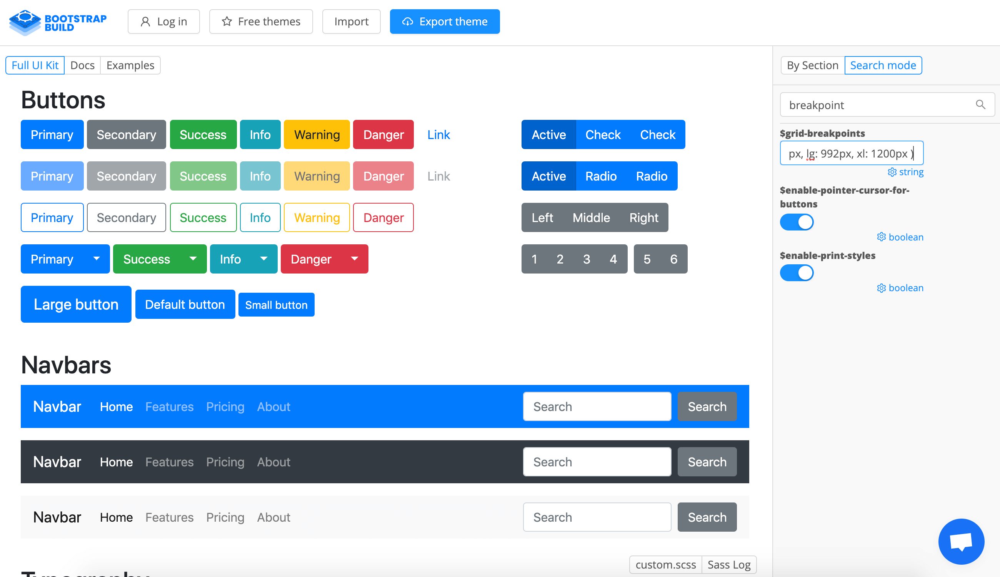

- [Bootstrap 4 Customizer](http://upgrade-bootstrap.bootply.com/bootstrap-4-customizer)

  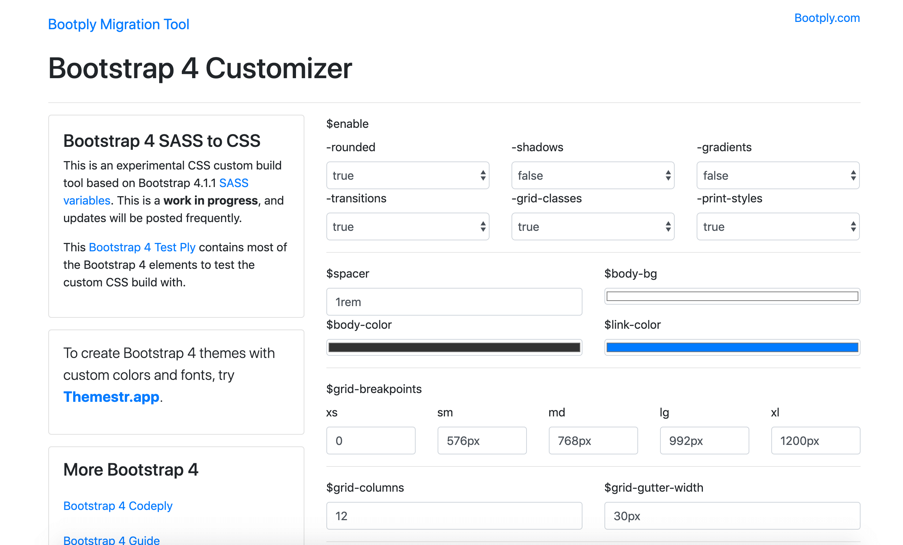

## 設計注意

最後全螢幕適配的設計可以是 tricky 的，以下分成幾項是需要注意的

- 位置

  檢視是否所有頁面元素都是相對置中
  或者在小螢幕的設備中是否會因為鄰近的元素壓縮自身容器的寬度

- 容器空間 (尺寸)

  例如頭部的中間 logo 的容器在中設備以下時，空間被限縮，就無法同時展示 logo 和文字。

  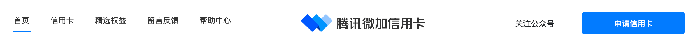

  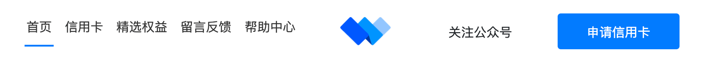

  另外像微加信用卡首頁的用戶故事，在大螢幕時可以採用左右圖文的設計，到小螢幕時也是因為空間關係必須改成上下排列。

  

  

- 交互

  最直接的差別是電腦用滑鼠、移動裝置用手指，所以像用戶故事區塊中有 slider 的效果，就必須支援兩種交互的操作。

  另外一個像是導航選單，如果在小螢幕中沒多餘的空間放頁面的入口連結，現在常見的作法是做成一個俗稱漢堡的選單，由上往下展開或由左右兩側滑出入口連結的選單。

  

  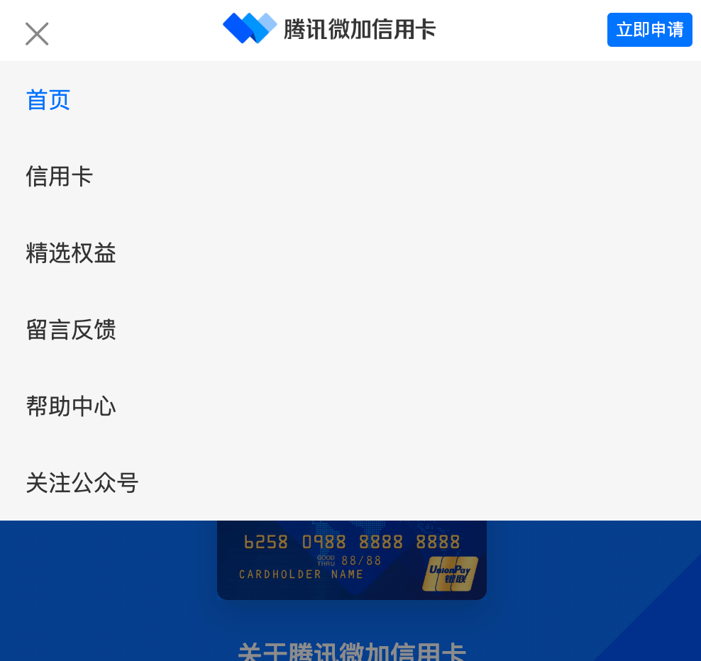

- 圖片和文字

  這兩項不需要考慮像素斷點之間的轉換，但是需要準備不同像素下可以顯示的圖片和文字的可讀性。

  有些頁面中會用到整塊圖片的背景，要確認在所有螢幕中，圖片的焦點是否都可以一致，例如下圖中的 banner 焦點在兩位人物的交易動作，在所有的螢幕中都可以保持容易被看見的視角。

  還有就是像是常用的標題和副標題文字大小，也需要做個相對適度的縮放。

  
