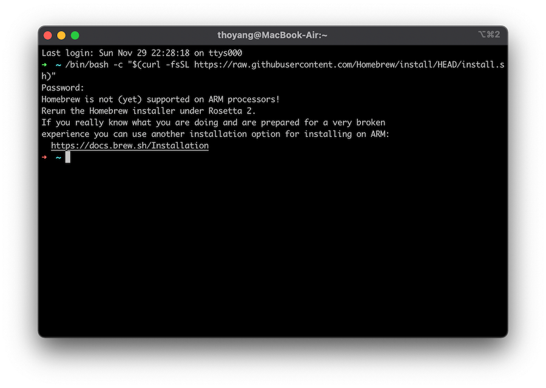
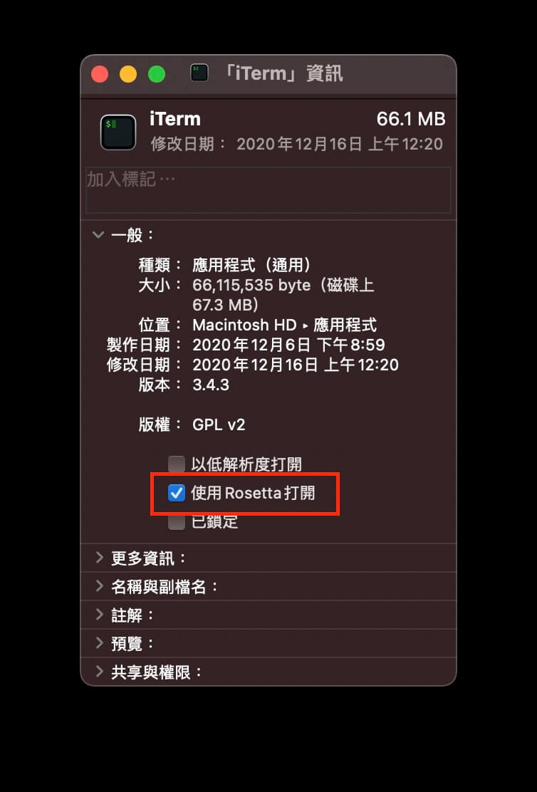

在 youtube 上看了很多關於蘋果晶片的評測

幾乎一致獲得好評

但是大部分都是針對文字工作或影片創作者的使用心得

分享一篇給開發者看的

<!-- more -->

簡單一個結論

由於 arm 架構的 SoC 在硬體模組間溝通更加快速

執行程式和續航力上表現都是大幅成長

## 環境配置

先從 App Store 下載的 Xcode 軟體

下載完成之後打開同意協議讓 Xcode 完全正常啟動過一次

沒有用 Xcode 開發 Mac/iOS App 就可以關掉了 😆

打開終端機執行下面命令

```bash
xcode-select --install
```

就會安裝一些 Xcode 附加的開發工具，像是 ruby, git...等等

- 終端機

  個人習慣使用 [iTerm2](https://iterm2.com/)

  用 iTerm2 就可以在社群貢獻的 [iTem2-Color-Schemes](https://github.com/mbadolato/iTerm2-Color-Schemes) 找自己喜歡的樣式

  Shell 使用 [Oh My Zsh](https://ohmyz.sh/)

  社群也提供很多方便的[外掛](https://github.com/ohmyzsh/ohmyzsh/wiki/Plugins)和[主題](https://github.com/ohmyzsh/ohmyzsh/wiki/Themes)

  多樣主題樣式打造屬於自己的終端機

  個人化終端機看起來更有個性

  後續專門寫一篇文章介紹

- Homebrew

  安裝套件管理工具 [Homebrew](https://brew.sh/)

  執行首頁的安裝命令會阻擋安裝

  

  其實 brew 相關功能並沒有不相容的問題

  主要的問題是你要安裝的套件是否支援 **arm64-darwin**

  可以在 [https://formulae.brew.sh](https://formulae.brew.sh/) 查套件的 Bottle (binary packet) 是否支援 Apple Silicon

  homebrew 團隊不負責修復

  需要你提 issue 到該安裝的套件

  基本上主流的套件都已支援

  詳情可以追蹤：[https://github.com/Homebrew/brew/issues/10152](https://github.com/Homebrew/brew/issues/10152)

  *p.s. 2021/01/24 測試已經不封鎖安裝腳本*

- Nodejs

  node 15.3 以上原生支援 arm64

  之前一直是用 [nvm](https://hoyangtsai.github.io/blog/2016/07/26/install-multiple-version-of-nodejs/) 管理 nodejs 版本安裝

  後來又看到 [asdf](https://asdf-vm.com/#/) 可以管理多種開發語言 (deno, ruby, python, nodejs) 的版本安裝

  但試著安裝 nodejs 出現需要 GunPG 驗證工具

  ```bash
  ➜ asdf install nodejs latest:15
    % Total    % Received % Xferd  Average Speed   Time    Time     Time  Current
                                  Dload  Upload   Total   Spent    Left  Speed
  100  3811    0  3811    0     0   3480      0 --:--:--  0:00:01 --:--:--  3480
  You should install GnuPG to verify the authenticity of the downloaded archives: https://www.gnupg.org/
  ```

  所以又回去用 nvm 安裝 nodejs

  結果遇到另外一個狀況

  因為開發的專案有使用 sass-loader

  執行 `npm installl` 會印出一些警告訊息一直無法完成安裝

  ```bash
  2 warnings generated.
    c++ -o Release/obj.target/libsass/src/libsass/src/ast_fwd_decl.o ../src/libsass/src/ast_fwd_decl.cpp '-DNODE_GYP_MODULE_NAME=libsass' '-DUSING_UV_SHARED=1' '-DUSING_V8_SHARED=1' '-DV8_DEPRECATION_WARNINGS=1' '-DV8_DEPRECATION_WARNINGS' '-DV8_IMMINENT_DEPRECATION_WARNINGS' '-D_DARWIN_USE_64_BIT_INODE=1' '-D_LARGEFILE_SOURCE' '-D_FILE_OFFSET_BITS=64' '-DOPENSSL_NO_PINSHARED' '-DOPENSSL_THREADS' '-DLIBSASS_VERSION="3.5.5"' -I/Users/xxx/Library/Caches/node-gyp/15.4.0/include/node -I/Users/xxx/Library/Caches/node-gyp/15.4.0/src -I/Users/xxx/Library/Caches/node-gyp/15.4.0/deps/openssl/config -I/Users/xxx/Library/Caches/node-gyp/15.4.0/deps/openssl/openssl/include -I/Users/xxx/Library/Caches/node-gyp/15.4.0/deps/uv/include -I/Users/xxx/Library/Caches/node-gyp/15.4.0/deps/zlib -I/Users/xxx/Library/Caches/node-gyp/15.4.0/deps/v8/include -I../src/libsass/include  -O3 -gdwarf-2 -mmacosx-version-min=10.7 -arch arm64 -Wall -Wendif-labels -W -Wno-unused-parameter -std=c++11 -stdlib=libc++ -fno-strict-aliasing -MMD -MF ./Release/.deps/Release/obj.target/libsass/src/libsass/src/ast_fwd_decl.o.d.raw   -c
  In file included from ../src/libsass/src/ast_fwd_decl.cpp:1:
  ../src/libsass/src/ast.hpp:1614:25: warning: loop variable 'numerator' of type 'const
        std::__1::basic_string<char>' creates a copy from type 'const std::__1::basic_string<char>'
        [-Wrange-loop-analysis]
          for (const auto numerator : numerators)
                          ^
  ../src/libsass/src/ast.hpp:1614:14: note: use reference type 'const std::__1::basic_string<char> &' to prevent
        copying
          for (const auto numerator : numerators)
              ^~~~~~~~~~~~~~~~~~~~~~
                          &
  ../src/libsass/src/ast.hpp:1616:25: warning: loop variable 'denominator' of type 'const
        std::__1::basic_string<char>' creates a copy from type 'const std::__1::basic_string<char>'
        [-Wrange-loop-analysis]
          for (const auto denominator : denominators)
                          ^
  ../src/libsass/src/ast.hpp:1616:14: note: use reference type 'const std::__1::basic_string<char> &' to prevent
        copying
          for (const auto denominator : denominators)
              ^~~~~~~~~~~~~~~~~~~~~~~~
                          &
  ```

  還到 node-sass 反饋 [issues](https://github.com/sass/node-sass/issues/3033)

  結果再退回安裝 node 12 版本

  如果要安裝 node 15.3 以下的版本

  到應用程式目錄找到 iTerm 右鍵打開**取得資訊**

  勾選 ☑️ 使用 Rosetta 打開

  

  結束 iTerm 重新打開就可以安裝 node 12 了

  安裝完成之後可取消勾選 Rosetta 打開

  *p.s. 2021/01/24 使用 node 15.6.0 再次嘗試安裝 node-sass 已經成功了*

  - yarn

    可以正常安裝使用

- Ruby

  用 [asdf](https://asdf-vm.com/#/) 安裝其他的版本執行 jekyll 的專案或 compass sass 編譯工具都沒有問題

- Docker - 已兼容

- Java

  也是在 youtube 上看到有用原生支援的 Zulu JDK 編譯已有的專案和 Rosetta 模式的版本做比較

  IntelliJ IDEA 也已經原生支援

- VS Code

  穩定版可以在 Resetta 模式使用

  或者可以選擇 Insider 版本原生支援

  之後穩定版也會原生支援

  詳情可以追蹤：[https://github.com/microsoft/vscode/issues/106770](https://github.com/microsoft/vscode/issues/106770)

- Photoshop

  Adobe 很多軟體已經為 Apple 晶片準備推出原生支援的版本

  其中包括 Photoshop

  目前處於 beta 階段

  但還是可以用 Rosetta 模式使用 Intel 版本

- Sketch - 版本 70 以上原生支援

- Apache

  運行蘋果晶片的 Mac 系統一樣有內建 httpd

  只是 macOS Server 5.7.1 版本之後從操作介面中移除 [https://support.apple.com/en-us/HT208312](https://support.apple.com/en-us/HT208312)

  不嫌麻煩的可以手動配置

  懶惰如我習慣使用 GUI 管理網頁服務

  改用第三方的網站管理工具 [MAMP](https://www.mamp.info/)

  在 Rosetta 模式下運行也沒有問題

- Git

  其實 git 安裝 Xcode 就內建了
  
  當然是原生支援

  有時候還是用 GUI app 來的方便

  之前一直是用 [Souretree](https://www.sourcetreeapp.com)
  
  但是隨著版本更新感覺越用越慢

  後來試著改用 [Fork](https://git-fork.com) 感覺順很多

  而且 Fork 是原生支援
  
  Sourcetree 是 Rosetta 模式執行 Intel 版本

- Android Studio & Flutter
  
  之前試玩了一下 Flutter 2，進行一系列的環境設置，過程一切順利  
  Android 模擬器於 Android 11.0 (R) SDK platform 30 已支援蘋果晶片  
  詳細資料和後續 issue 可以追蹤 [google/android-emulator-m1-preview](https://github.com/google/android-emulator-m1-preview)

- Miscellaneous

  - Profixier 3.4 會導致無預警重新開機

其他沒提到的也可以在以下兩個網站找一下相容情況

- [https://isapplesiliconready.com](https://isapplesiliconready.com/)
- [https://doesitarm.com](https://doesitarm.com)
