涉及前端開發後，所需必備的技能之一，網路代理。不論是文件代理還是網站代理，為了更真實模擬線上環境和 debug

<!-- more -->

很多人會選擇 Windows 開發，除了使用習慣，另外一點應該是 Windows 上有個好用又免費的代理工具 Fiddler。

但如果是非 Windows 開發者，就必須自行尋找解決方案。

像 Mac 的開發者，我在網路上找到像，有人是用 VM 的方式，在 Windows 虛擬機上安裝 Fiddler，再透過共享的網路解決代理；或者像其他大部分的人，直接在 Mac 上安裝 Charles 代理工具解決。

或許 Charles 也是個不錯的代理工具，但相較於 Fiddler 最大的差別是 Charles 是一個付費的軟體，所以取得上可能沒像 Fiddler 容易。

於是往 nodejs 方向去找代理工具，找到像 nrpoxy, anyproxy 和 whistle

nodejs 代理工具相較於 Fiddler 最顯而易見的區別就是跨平台，所以不管是用 Windows、Mac 還是 Linux 的開發者都可以使用。

簡單比較上述列的 nodejs 代理工具

- nproxy 功能不滿足需求，而且已經很久沒更新了
- anyproxy 相較 whistle 沒有這麼多樣性的代理配置和友好的操作介面
- whistle 功能完整，proxy 規則可以群組、export / import 配置

結果當然是選擇 whistle

先介紹 whistle 的功能特點

- 配置 hosts
- 修改 http, https, websocket 請求
- 修改響應，替換本地假數據
- 請求轉發
- 注入 html, js, css (pattern jsAppend:{<a href="https://github.com/Tencent/vConsole" target="_blank">vConsole.js</a>})
- debug 遠端頁面 (<a href="https://github.com/nupthale/weinre" target="_blank">weinre</a>://)

whistle 採用類似系統 hosts 配置的方式，透過域名、路徑、正則表達式、通配符、通配路径等匹配模型操作代理。

```txt
pattern(匹配模型) operatorURI(操作URI)
```

## 快速入門

因為 whistle 運行於 nodejs 環境，必須先確認系統已安裝 nodejs

從安裝到操作使用，主要分為四個步驟：

1. 安裝最新版 nodejs
2. 安裝 whistle
3. 啟動 whistle
4. 設置代理

### 安裝 Nodejs

Mac 系統建議用 <a href="https://brew.sh/" target="_blank">Homebrew</a> 安裝 nodejs

```bash
/usr/bin/ruby -e "$(curl -fsSL https://raw.githubusercontent.com/Homebrew/install/master/install)"
brew install node
```

或者用 [nvm 安裝 nodejs](http://hoyangtsai.github.io/posts/2016/07/26/install-multiple-version-of-nodejs/)

```bash
curl -o- https://raw.githubusercontent.com/creationix/nvm/v0.33.11/install.sh | bash
nvm install node
```

### 安裝 whistle

whistle 支持 `v.0.10.0` 以上版本的 Nodejs，但建議安裝最新版，以獲得更好的效能。

```bash
npm install -g whistle --registry=https://registry.npm.taobao.org
```

### 啟動 whistle

安裝 whistle 完成後，可以執行 `w2 help` 查看 whistle 相關命令說明

whistle 運行方式主要有

1. `w2 run` 在終端機前景運行代理程序，可在同一個終端機視窗中同時按下 `ctrl + c` 停止程序。
2. `w2 start` 在系統背景運行代理程序，可在任何終端機視窗輸入 `w2 stop` 停止程序。

### 設置代理

主要分成兩個客戶端

1. PC 端

   - 系統全局 - 所有應用的網路請求都會擷取
   - 瀏覽器 - 僅抓取瀏覽器中的網路請求
   - 微信開發者工具

2. Mobile 端

#### PC 端

- 系統

  在系統設定中網路的代理服務器，將網頁代理服務器（HTTP）和安全網頁代理服務器（HTTPS）的 ip 設置 whistle 代理服務器位址。
  如果啟動 whistle 時沒有修改 port 設置，默認為 127.0.0.1:8899

  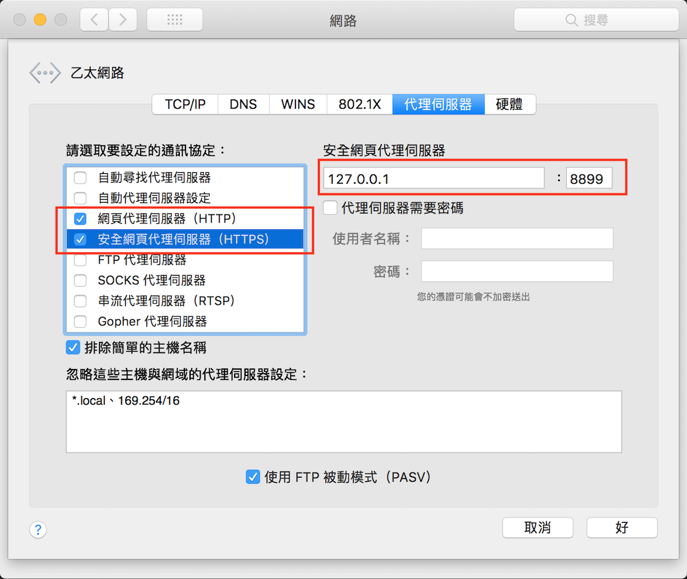

- 瀏覽器

  **Firefox**

  偏好設定 -> 一般 -> 網路代理伺服器 -> 設定...

  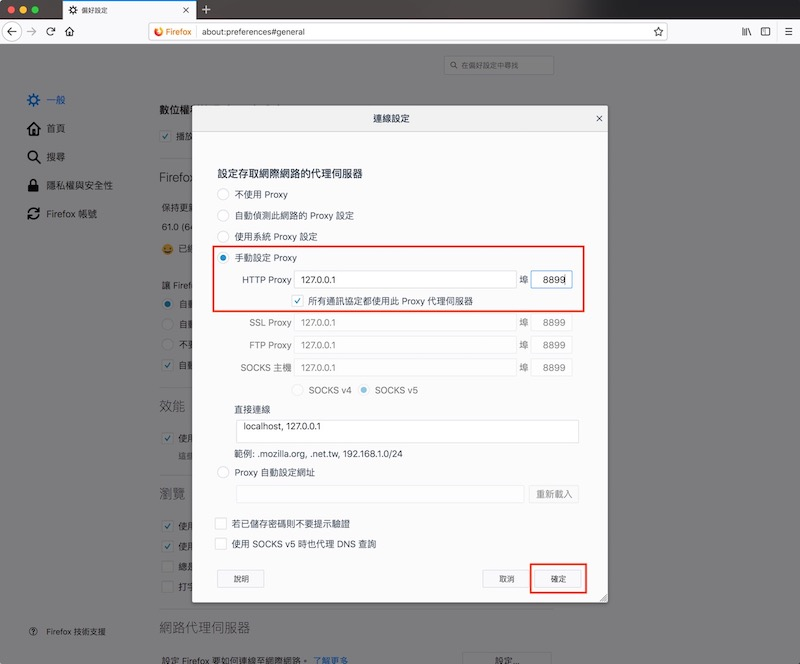

  **Chrome**

  使用擴充工具，推薦安裝 <a href="https://chrome.google.com/webstore/detail/proxy-switchyomega/padekgcemlokbadohgkifijomclgjgif" target="_blank">Proxy SwitchyOmega</a>

  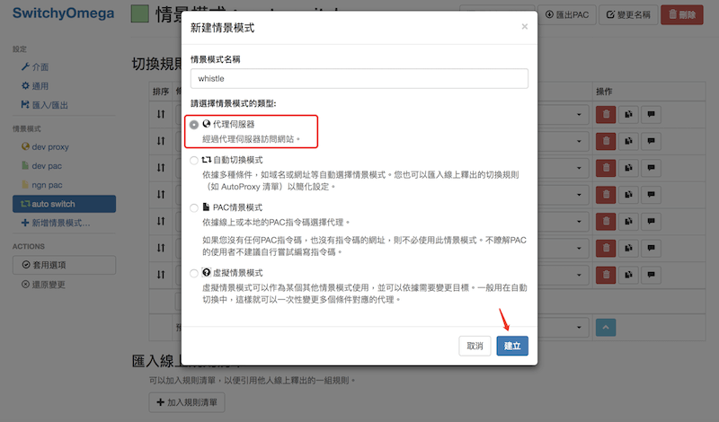

  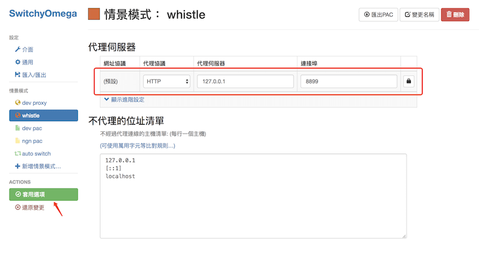

  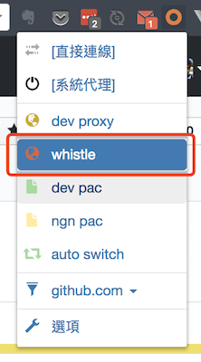

- 微信開發者工具
  
  頂部選單 -> 設置 -> 代理設置

  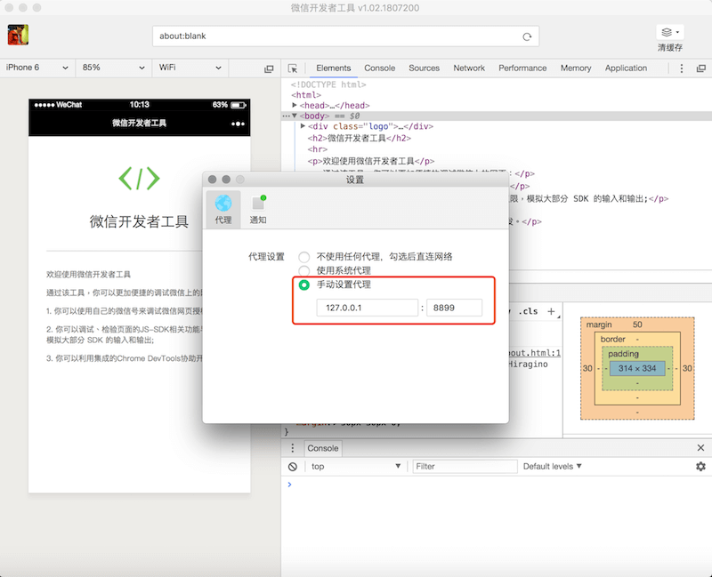

##### 設置 HTTPS

  要擷取 HTTPS 請求，需要導入 whistle 生成的證書到系統中

  先打開 whistle 工具選單的「HTTPS」視窗，勾選 "Capture HTTPS CONNECTs" 之後，點擊 QR Code 或 Download RootCA 下載 whistle 憑證

  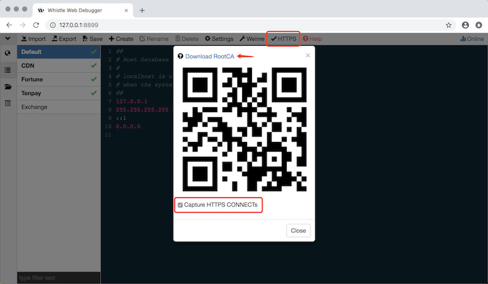

  打開鑰匙圈存取 (spotlight 搜尋 keychain) -> 搜尋 whistle -> 雙擊打開憑證，在信任的使用此憑證時，選擇"永遠信任" -> 關閉視窗，跳出輸入系統用戶密碼 -> 更新設定

  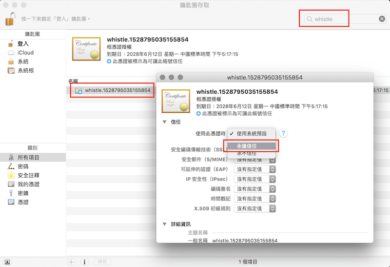

  最後驗證 whistle network 頁面看到 Protocol 一行有 HTTPS 的請求，確認配置成功。

  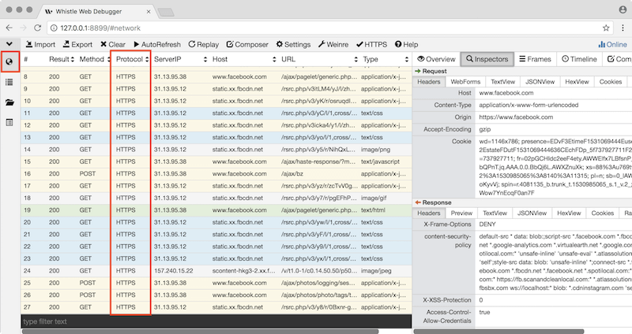

#### Mobile 端

設置手機代理之前，必須先確認電腦有兩個網路端口。

一是負責網路輸入、二是負責網路輸出 (wifi 熱點)，慶幸的是 Mac 系統內建的 Internet 共享是可以拿 wifi 當熱點的，所以只需確認網路輸入源，是來自有線網路 (乙太網路) 或 usb 網路接收器。

- 電腦網路 wifi 分享

  先把電腦網路設置透過 wifi 共享

  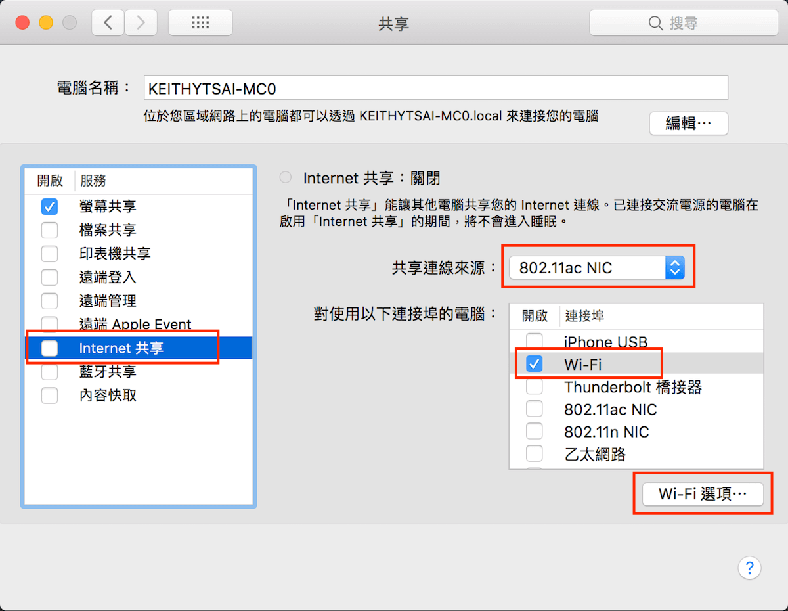

  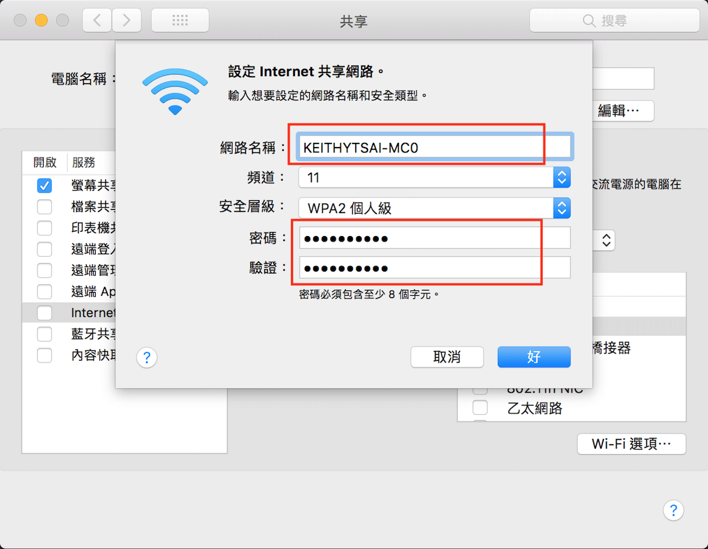

- 手機網路設定代理

  手機連上電腦的 wifi 熱點，設置代理

  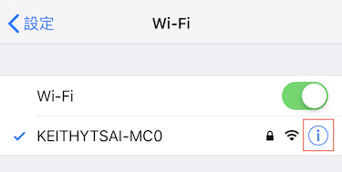

  確認路由器伺服器 ip，點擊設定代理伺服器

  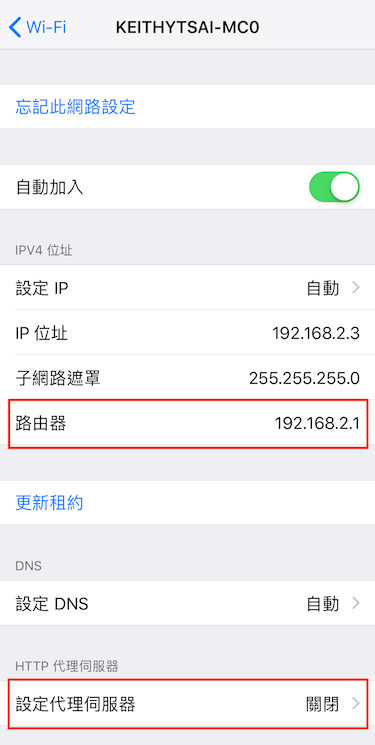
  
  選擇手動，填入伺服器 ip 和 port

  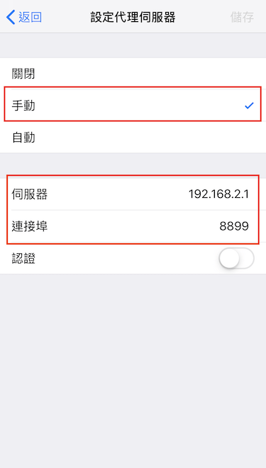

  用 Safari 訪問 <http://rootca.pro/>，下載 whistle 憑證並安裝

  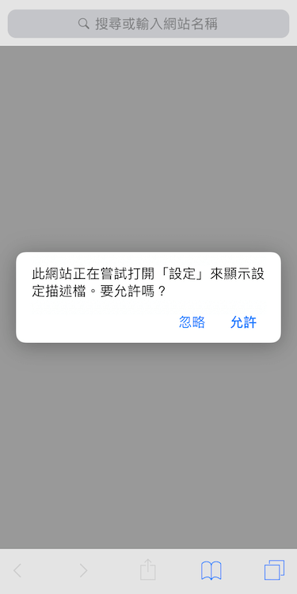

  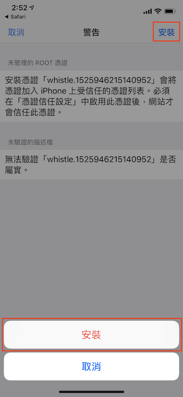

  可以從一般 -> 描述檔與裝置管理 -> whistle.xxxxxxx，確認是否為<span style="color:#5cc959;">已驗證</span>

  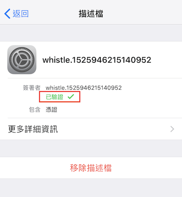

- 設置信任憑證

  憑證設為信任，開發微信 H5 才可以代理 https 頁面

  從一般 -> 關於手機 -> 憑證信任設定 -> whistle.xxxxxxx，設定開啟

  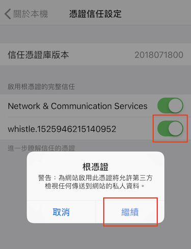

### 代理規則

開發經常遇到的情境有以下幾種

1. 修改請求位置
2. 修改響應，替換本地假數據
3. 同域名，不同子路徑，分別訪問本地前端頁面和遠端後台接口

在 whistle rules 的地方配置代理規則

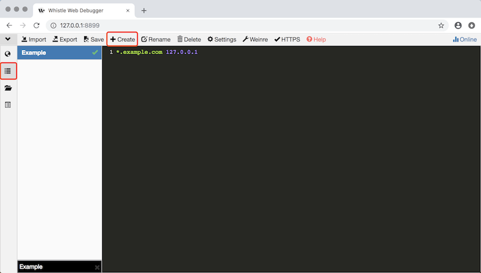

- 修改請求位置
  > 開發或發布流程，前端頁面和CDN資源在不同源的情況

  和配置系統 hosts 一樣，如果在系統路徑 /etc/hosts 增加一行

  ```bash
  www.example.com 127.0.0.1
  ```

  在瀏覽器訪問 `www.example.com` 時就會代理到本地

  之後再配置本地服務器 (Apache, Nginx...) 的 virtual host，就可以模擬訪問線上環境

  但是 whistle 比配置系統 hosts 更強大的是，如前面介紹的 pattern 支持通配符，如下例

  ```bash
  *.example.com 127.0.0.1

  # 說明
  # proj1.example.com         127.0.0.1
  # project2.example.com      127.0.0.1
  # [任何字串長度].example.com  127.0.0.1
  ```

- 修改響應，替換本地假數據

  > 有後台接口文件，但實際接口還無法調用的情況

  這時候就必須先用 json 假數據文件模擬後台接口響應

  ```bash
  /example.*\/cgi\/(.*\.do)$/ resBody:///Users/hoyang/path/to/project/mock_data/$1 resType://json resCharset://utf8 statusCode://200

  # $1 含層級的路徑
  # www.example.com/cgi/(common/userinfo.do)  $1 = common/userinfo.do
  # => /Users/hoyang/path/to/project/mock_data/(common/userinfo.do)
  #
  # www.example.com/cgi/(news/list.do)        $1 = news/list.do
  # => /Users/hoyang/path/to/project/mock_data/(news/list.do)
  ```

  也可以模擬包含 id get 請求
  
  ```bash
  /example.*\/cgi\/(.*\.do)\?id=(.*)$/ resBody:///Users/hoyang/path/to/project/mock_data/$1/$2 resType://json resCharset://utf8 statusCode://200

  # $1 含層級的路徑; $2 id後面的關鍵字
  # www.example.com/cgi/(news/post.do)?id=(6)  $1 = news/post.do; $2 = 6
  # => /Users/hoyang/path/to/project/mock_data/(news/post.do)/(6)
  ```

- 同域名，不同子路徑，訪問不同目標位置

  > 後台接口已實現，本地開發 UI 和邏輯

  whistle rules 的 pattern 除了支持通配符，也支持正則表達式<br>
  所以可以用 regex 過濾子路徑，甚至一行表達式匹配子域名、頂級域（Top-Level Domain）

  ```bash
  # 指定特定域名和子路徑後台接口
  /xyz\.example\.com\/(?!cgi)/i 127.0.0.1
  /xyz\.example\.com\/cgi/ 10.55.66.123

  # xyz.example.com/其他字串  127.0.0.1
  # xyz.example.com/cgi      10.55.66.123
  #
  # 註: 也可以不用寫第二行，訪問路徑含 /cgi 就不會連到本地
  ```

  ```bash
  xyz.example.com 127.0.0.1
  /xyz\.example\.com\/cgi/ 10.55.66.123 # 不會生效

  # 註: 不能只用 hosts 的寫法
  #     hosts 表示式優先級會比較高
  #     第二行的 /xyz\.example\.com\/cgi/ 10.55.66.123 不會生效
  ```

  ```bash
  # 不指定二級域名和頂級域
  /.*example.*\/(?!cgi)/i 127.0.0.1

  # xyz.example.cn/user       127.0.0.1
  # xyz.example.com.hk/news   127.0.0.1
  # xyz.example.com/cgi       忽略
  # xyz.example.com.hk/cgi    忽略
  # sub.xyz.example.com/cgi   忽略
  ```

#### 無腦代理法

直接替換/模擬 server 文件

```bash
cdn.example.com/path/to/file.js resBody:///Users/hoyang/path/to/local/file.js resType://js resCharset://utf8 statusCode://200
```

#### 模擬弱網環境

```bash
cdn.example.com 127.0.0.1 resSpeed://300
# resSpeed://300 表示回應速度為 300 kb/s
```
