身為Compass框架創建人，Sass核心團隊成員的 Chris Eppstein 曾這麼說過。
> CSS is simple. It's simple to understand. But CSS is not simple to use or maintain.

<!-- more -->

CSS看似簡單，但怎麼樣才能稱得上好的CSS程式碼呢？

剛開始接觸前端的時候，所撰寫的程式碼無非是以專案為導向，以自己來說，接到一個需求莫過於經歷：接到需求 -> 拆解需求 -> 完成需求。對於一個 HTML5 領域的新人來說，最直接簡單的方式就是透過 Google 來解決問題和學習，當時根本不懂什麼是複用性，寫出許多重複的程式碼

```css{2,5,8,11}
.box-1 {
    border: 1px solid I#ccc;
    width: 120px;
    height: 120px;
    border-radius: 10px;
}
.box-2 {
    border: 1px solid I#ccc;
    width: 200px;
    height: 200px;
    border-radius: 10px;
}
```

更糟糕的是，如果多人共同開發甚至會在代碼裡頻繁的出現令人頭痛的 `!important`

隨著前端逐漸成熟，各種 CSS 開發的問題不斷湧現，開始有人為了解決這些問題提出一些 CSS Methodology，以下這幾種是其中比較廣為人知的：

- OOCSS
- BEM
- SMACSS

無論是哪個方法，所追求的目標都是一致的，那就是 － 如何寫出良好的CSS架構

良好的 CSS 架構包含這四點：

- Predictable（可預測的）
- Reusable（可複用的）
- Maintainable（可維護的）
- Scalable（可擴展的）

## 命名方法

說了這麼多，接下來就來看看幾個比較常見的 CSS 命名方法吧！

### OOCSS

看到「OO」部分人應該能夠直接聯想到 Object-Oriented

Nicole Sullivan 將類似的概念應用到CSS上，提出了 OOCSS

而 OOCSS 的 OO 究竟是什麼？

根據官網寫的，CSS Object 包含以下四點：

1. HTML的部分，可以是一個或多個 DOM 節點
2. CSS的部分，用來定義樣式，並且是那些容器的 classname
3. 如果有背景圖
4. Javascript的行為都跟 object 有關聯

其實光看定義還是有點不太清楚，接著就來看幾個例子

OOCSS 主要有兩大原則：

1. Separation of Structure from Skin

Structure 就是涉及架構的部分，如 `margin`, `position`...等等；Skin 則是偏向表現型態的部分，像是 `color`, `font-size`, `border`...等等

這個是個比較極端的案例，我們可以發現這三個元素都有這幾個相同的樣式

```css{4-6, 12-14, 20-22}
#button {
    width: 100px;
    height: 25px;
    border: solid 1px #1ED3A9;
    background: linear-gradient(#09D083, #1ED3A9);
    box-shadow: rgba(0, 0, 0, .5) 2px 2px 5px;
}

#element {
    width: 300px;
    min-height: 100px;
    border: solid 1px #1ED3A9;
    background: linear-gradient(#09D083, #1ED3A9);
    box-shadow: rgba(0, 0, 0, .5) 2px 2px 5px;
}

#box {
    width: 500px;
    min-height: 200px;
    border: solid 1px #1ED3A9;
    background: linear-gradient(#09D083, #1ED3A9);
    box-shadow: rgba(0, 0, 0, .5) 2px 2px 5px;
}
```

套用上了 OOCSS 的第一個原則，程式碼會變成這樣子

```css
.button {
  width: 100px;
  height: 25px;
}
.element {
  width: 300px;
  min-height: 100px;
}
.box {
  width: 500px;
  min-height: 200px;
}
.theme {
  border: solid 1px #1ED3A9;
  background: linear-gradient (#09D083, #1ED3A9);
  box-shadow: rgba(0, 0, 0, .5) 2px 2px 5px;
}
```

將共用的表現型樣式抽取出來，並且以 class 取代 ID 作為 selector 增加複用性。

1. Separation of Containers and Content

將 css 與 html 盡量切割，以 class selector 來定義樣式並放入該 html 元素中

這個範例是兩個 `<h3>` 字體大小相同、顏色不同的情境

```css
#header h3 {
  font-size: 12px;
  color: #888888;
}
```

```css
#header h3,
#footer h3 {
  font-size: 12px;
  color: #888888;
}
#footer h3 {
  color: #444444;
}
```

套用上了 OOCSS 的第二個原則，我們的程式碼會變成這樣子

```css
.header {
  color: #888888;
}
.footer {
  color: #444444;
}
.fontSize12 {
  font-size: 12px;
}
```

而 HTML 的部分則會變成這樣

```html
<header class="header fontSize12">HEADER</header>
<footer class="footer fontSize12">FOOTER</footer>
```

無論是原則一或是原則二 OOCSS 都是再將 CSS 做個清楚的分離，增加複用性

看完上面原則及對應的範例後，相信還是有部分的人對於 OOCSS 的應用感到疑惑，Nicole Sullivan應用了 OOCSS 概念實作了個 Media Object 的範例，在這個範例裡可以更清楚的了解 OOCSS 的應用方式。

依照不同情境，在 Media 那層上面添加對應的 DOM 結構

- Demo 1

  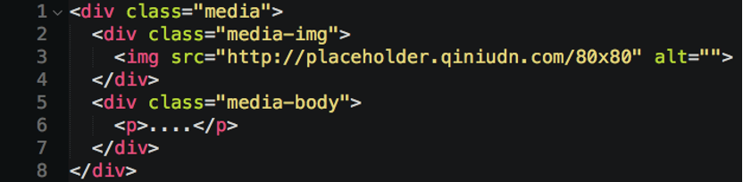

  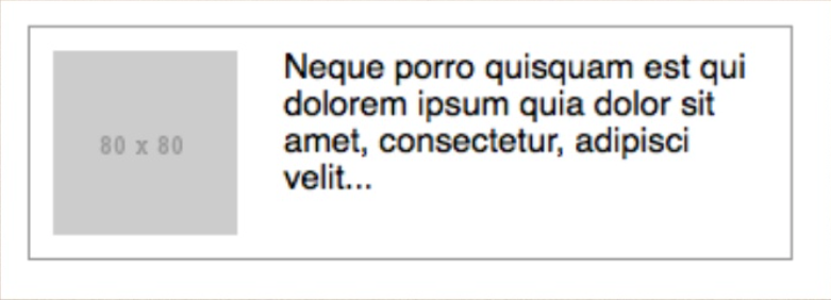

- Demo 2

  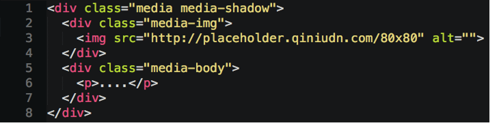

  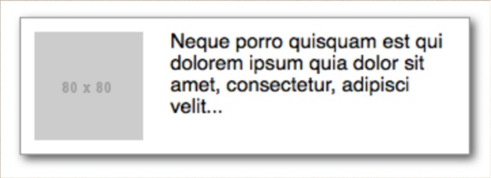

- Demo 3

  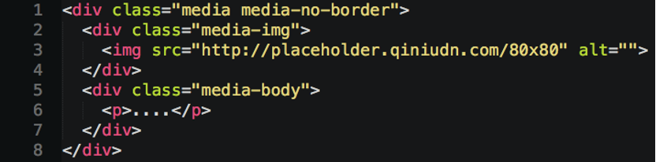

  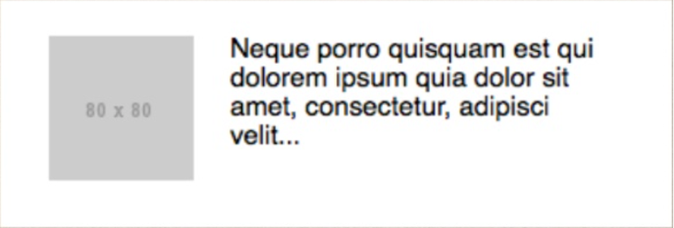

這個是 OOCSS 所提供的內容，裡面清楚的標示了有哪些屬性以及是否為必填項

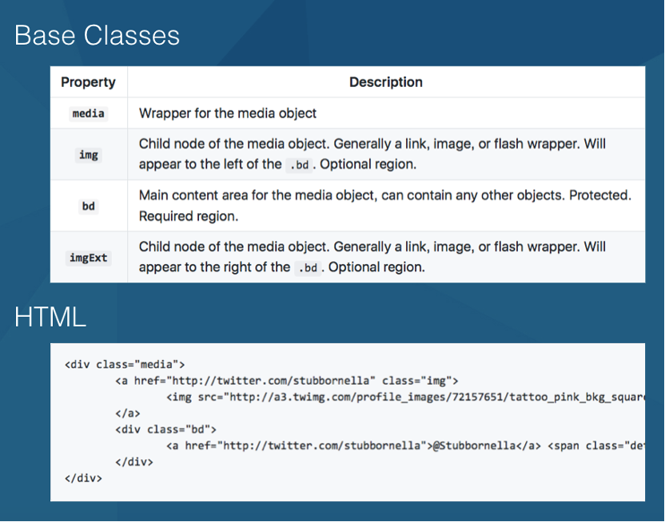

其實我們可以把 Javascript 的概念應用到這，在 Javascript 裡可以把 Function 當成一個 Object 來看，可以帶參數

用相同的方式，我們把 Media Object 的這整個看成一個 Function，提供的那些 Base Classes 就是參數，依照是 required 或 optional 來決定是不是要加入

<p class="hi-red">在這個 OOCSS 概念下 HTML 跟 CSS 是不能分開來看的！</p>

### BEM

BEM 就是 <span class="hi-red">B</span>lock <span class="hi-red">E</span>lement <span class="hi-red">M</span>odifier 的縮寫

是由 Yandex 這間公司所提出的，這間公司有點像是俄羅斯的 Google，主要是做搜索引擎。

BEM的特色

- 強調模組化
- 可複用的CSS
- 功能導向的命名方式

#### Block

就是一個獨立並可重複使用的頁面元件

命名方式：超過兩個以上的單字中間 dashed 分隔

可以把整個 TAB 切換看成是一個 Block

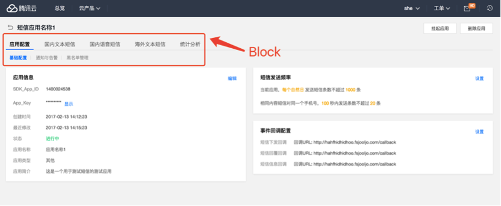

#### Element

是 Block 的一部分，必須存在 Block 底下，但 Block 不一定要有 Element (因為一定存在於 Block)

命名方式：Block Name雙底線Element Name

TAB 組件中的每個選項就是一個 Element

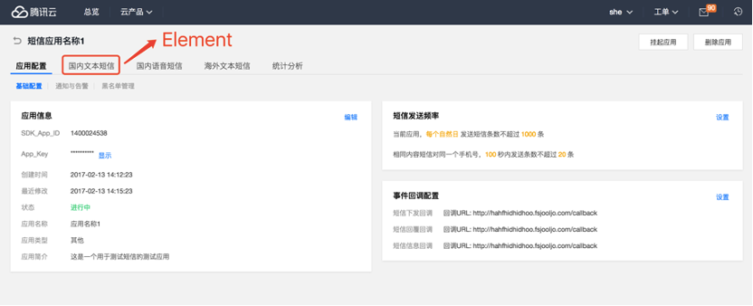

#### Modifier

用來定義 Block 或 Element 的狀態或屬性

命名方式：Block Name 或 Element Name 兩個 dashed Modifier Name

TAB 組件中的每個選項的 hover、選中狀態都是 Modifier

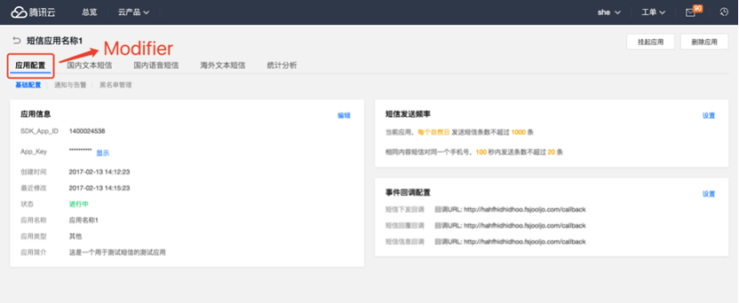

最後我們來看看依照 BEM 的架構來區分檔案結構會是長這樣子的


### SMACSS

三大原則

- 將結構分類
- 明確定義命名規則
- CSS與HTML分離

SMACSS 將結構分類成五種

1. Base
2. Layout
3. Module
4. State
5. Theme

#### Base Rules

這個部分只能使用 element selectors 不能使用 class/ID

CSS Reset 的部份是在 Base 這個區塊實踐

這個理論建議在 Base 這個地方設置 background color

SMACSS 建議不要使用 `!important`，在 Base 部分有嚴格禁止使用

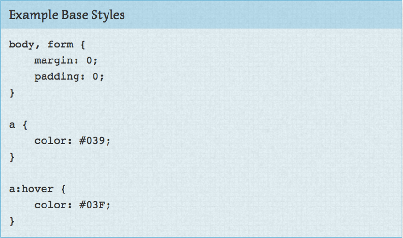

#### Layout Rules

主要是定義佈局相關的，SMACSS 只考慮單個頁面的呈現。

頁面佈局基本上都是單一的，所以在 Layout 的部分會使用 ID selectors 去定義樣式

但如果有需要使用 classname 命名需要以 `l-` 為開頭

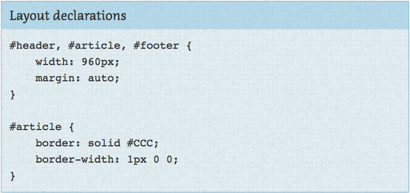

#### Module Rules

Module 基本上與 Layout 相同，都是頁面上的區塊，只是偏向於內容區塊

禁止使用 id 或是 element selector，只能使用 class selector

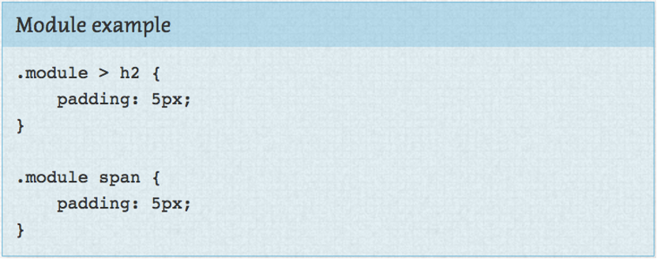

#### State Rules

定義狀態，與 Layout 或 Module 做搭配

命名都是以 `is-` 為開頭

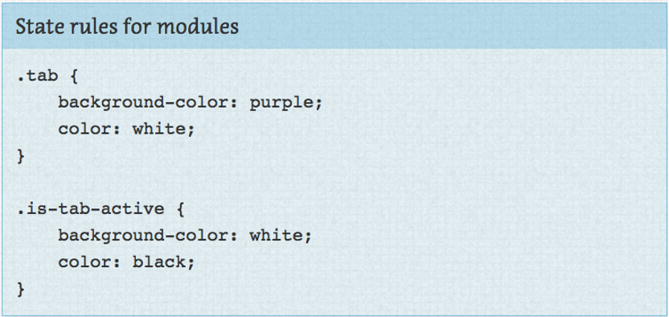

#### Theme Rules

針對網站主視覺做定義，像是品牌色或字型等等

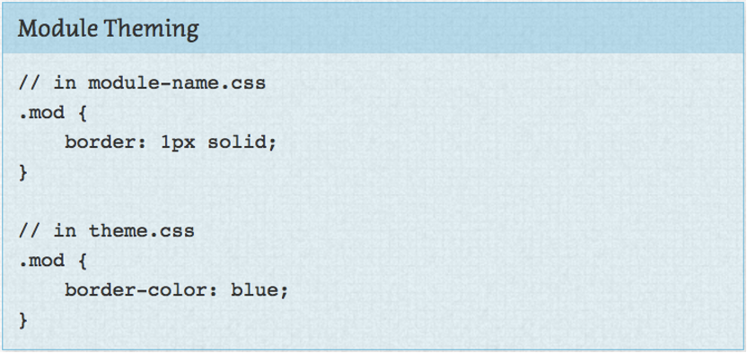

### CSS 框架

最後來介紹一個由 Yahoo 開發的框架 - Atomic CSS

它有這幾個優點：

- CSS style 最小元件化
- 樣式複用性最大化
- 不會有 class 命名衝突，因為保證一個 class 只會被宣告一次
- CSS 文件大小非常小，透過 Atomic CSS 的 parser（or webpack loader），只會產生你有使用到的 classname 的 stylesheet
- 產生出來的CSS文件非常適合壓縮，CSS 文件會盡量照著 gzip 的壓縮方式，將適合壓縮、重複的字元擺在一起

> 跟另外一套 [TailwindCSS](https://tailwindcss.com/) 概念類似

這是 Atomic CSS 搭配HTML寫出來的樣子，跟其他CSS方法論最大的差異是 classname 並不語義化，看起來很整潔，但是乍看之下並不知道實際代表的意思

這個是配置檔案，支持定義參數

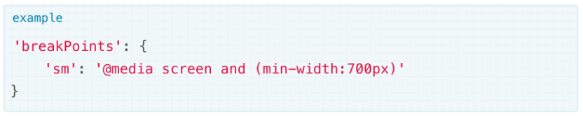

HTML的使用方式

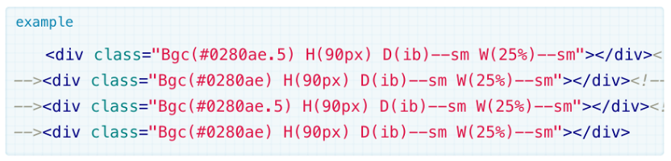

<br>

```css
.Bgc\(\#0280ae\.5\) {
  background-color: rgba(2,128,174,.5);
}
.Bgc\(\#0280ae\) {
  background-color: #0280ae;
}
.H\(90px\) {
  height: 90px;
}
@media screen and (min-width: 7000) f
  .D\(ib\)--sm {
    display: inline-block;
    zoom: 1;
  }
  .W\(25\%\)--sm {
    width: 25%:
  }
}
```

透過編譯，產生的樣式文件，此時出現較為熟悉的CSS代碼

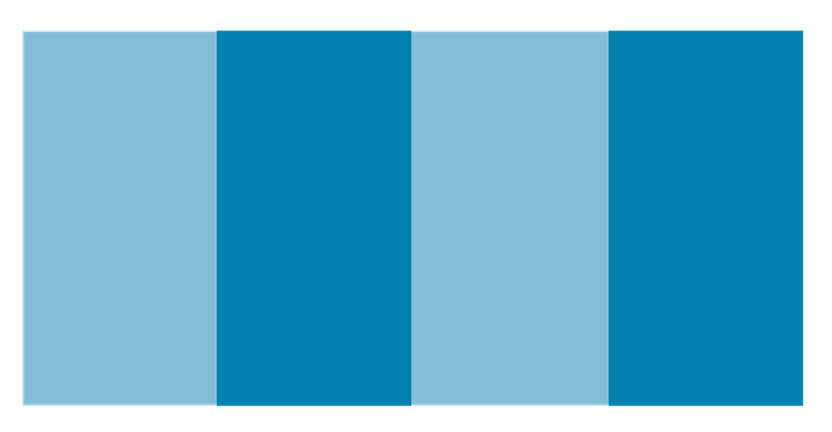

其實，換個角度看，應用了Atomic CSS，感覺就像是在寫 inline-style，只是我們用 classname 的方式來表示而已

這樣的應用，讓我們可以輕易地達到『Define once, use everywhere.』的目的

### What is Next？

看了 OOCSS、BEM、SMACSS 這三方法論，感覺好像很完善，但實際認真去想想...當專案愈來愈大、共同開發的人數愈來愈多，class 命名衝突的狀況就會愈來愈多。

因應這種狀況，就有人提出了 CSS Modules 來解決這些問題，但這個議題並不屬於這篇文章所要探討的重點，因此先不做介紹。

### 結論

沒有完美的方法論，每個方法論都有各自的優缺點，並不是將方法論完全應用到專案中，就能保證專案中的代碼品質是最佳的。

畢竟，理論終究是理論，除了方法論外還要適時的搭配規範進行管理，這樣才能寫出較好的CSS。

### Reference

- [OOCSS](http://oocss.org)
- [OOCSS Github](https://github.com/stubbornella/oocss)
- [BEM](http://getbem.com)
- [SMACSS](https://smacss.com)
- [Atomic CSS](https://acss.io)
