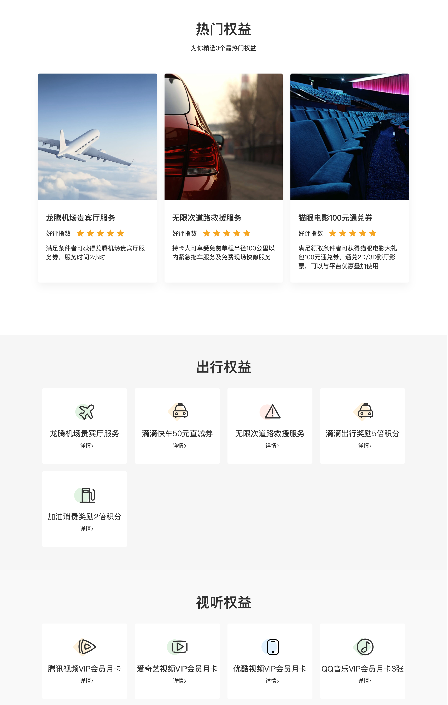
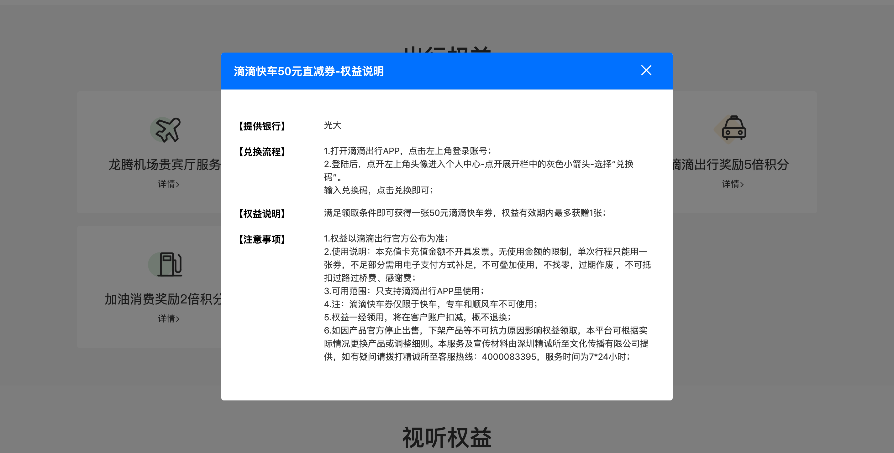
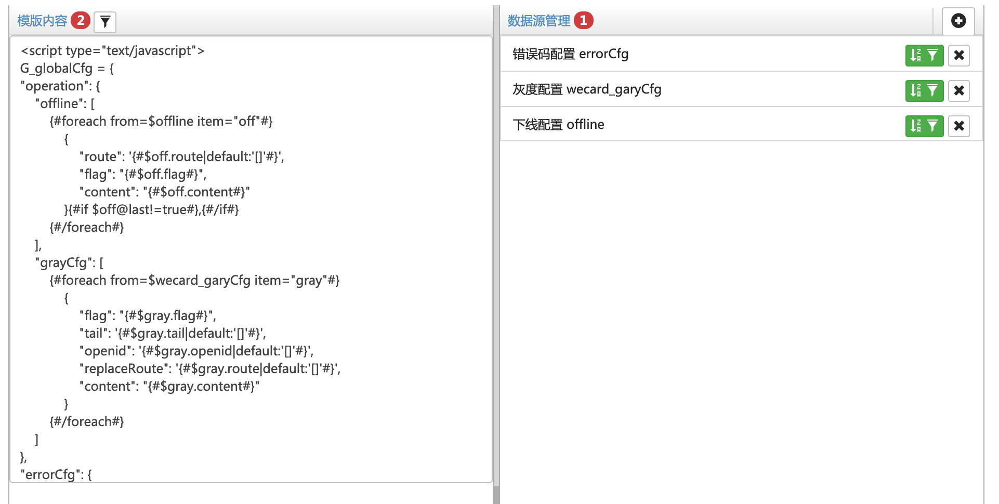
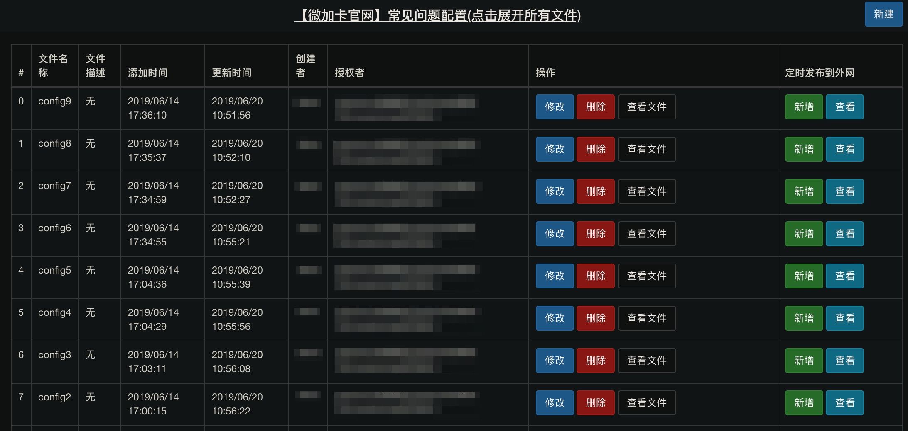
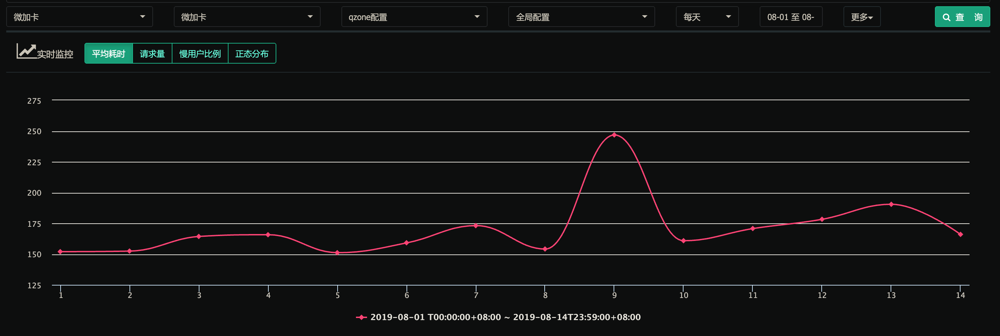
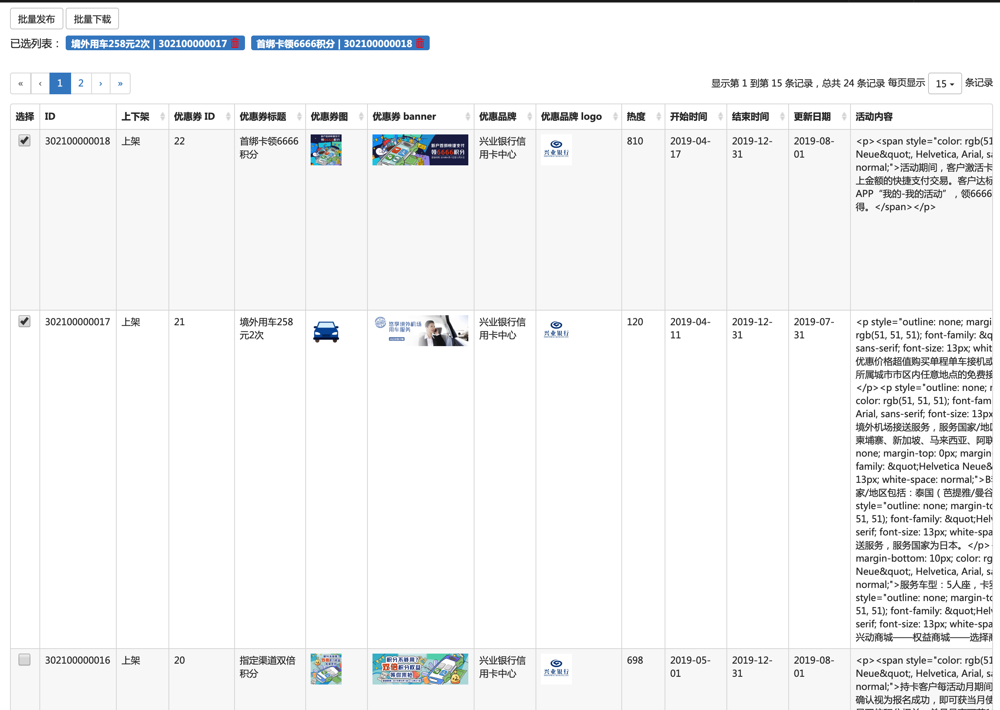
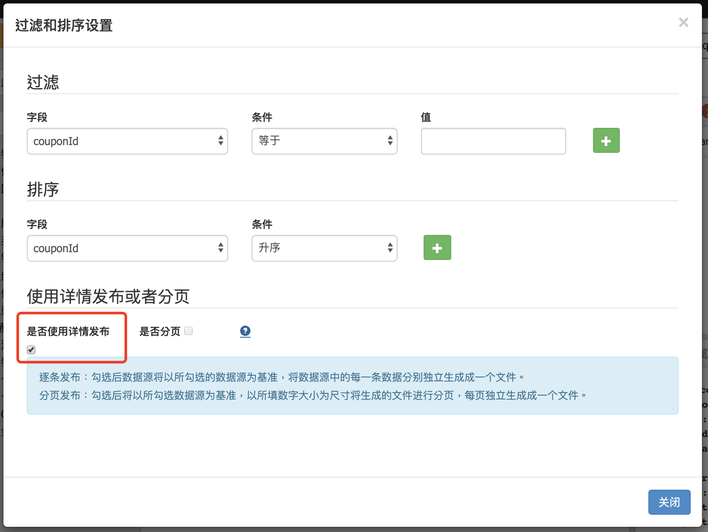

[騰訊微加信用卡](https://wepluscard.qq.com/mdft/index.shtml)官網是一個可以在手機、平板和桌面等多終端上瀏覽的產品官網，除了留言反饋的地方沒有其他與用戶的數據交互，所以在沒用後端資源的情況下，希望網站內容可以根據信用卡的合作內容彈性的修改。

<!-- more -->

網站第一版用的是之前開發常用的公司內部 Qzone 配置系統，它可以自定義數據結構，但請求時返回的檔案是固定的模版，只能是異步 callback 或 CMD 模式引用取得配置內容。

```js
;(function () {
    var params = {
      // 自定義數據結構
    }
    typeof callback_168_config1 === "function" && callback_168_config1(params)
    this.define && define(function (require, exports, module) {
        return params
    });
})()
```

## 搜尋引擎優化

產品官網的搜尋引擎優化 (SEO) 是必備的需求之一，所以開發完之後給 SEO 方案提供商進行審核，列出一些需要優化的點，如：

1. 網址層級

    wepluscard.qq.com<span class="hi-red">/mdft/</span>index.shtml 權重比 wepluscard.qq.com<span class="hi-red">/mdft/web/</span>index.shtml 高，最好是只有 host 後面接模塊名，如 wepluscard.qq.com/index.shtml 或 wepluscard.qq.com/feature.shtml ... 等

2. 完善 meta 標籤和描述
3. 標籤語義化
4. 標籤規範，如 img 加 alt 屬性...等
5. 靜態內容

靜態內容的部分，第一版網站中需要配置的地方，如 [騰訊微加信用卡權益](https://wepluscard.qq.com/mdft/feature.shtml) 除了 banner 以外，其他區域都是當前訪問頁面，再請求配置系統的 JS 檔案動態 render 權益的分類集和 Vue 的點擊事件綁定。





如果把整個用卡權益頁做成靜態的，這樣會變成開發的維護成本高，所以需要在開發的維護性和產品運營能力中取得平衡。

要實現靜態內容網站可能會先想到後台直出，但如開頭說的這是一個沒使用後台的項目，用在這個地方也有殺雞焉用牛刀的感覺，不在考慮方案內。

如 Vue SSR 介紹

> 如果你調研服務器端渲染 (SSR) 只是用來改善少數營銷頁面（例如 /, /about, /contact 等）的 SEO，那麼你可能需要預渲染。無需使用 web 服務器實時動態編譯 HTML，而是使用預渲染方式，在構建時 (build time) 簡單地生成針對特定路由的靜態 HTML 文件。優點是設置預渲染更簡單，並可以將你的前端作為一個完全靜態的站點。

[服務器端渲染-vs-預渲染-ssr-vs-prerendering](https://ssr.vuejs.org/zh/#%E6%9C%8D%E5%8A%A1%E5%99%A8%E7%AB%AF%E6%B8%B2%E6%9F%93-vs-%E9%A2%84%E6%B8%B2%E6%9F%93-ssr-vs-prerendering)

像 React 和 Vue 這些 Web 框架為了解決 SPA 這類的問題，開發社群已提供預渲染的插件，但是預渲染通常只輸出一個頁面的初始狀態，而且需基於 Webpack 開發構建。

這個項目不使用 Webpack 開發，預期不只是預渲染一個頁面的初始狀態，而是一個頁面所有可能性操作狀態，這樣才能全面覆蓋所有靜態內容。

## vTools 數據管理平台

借助於另外一個公司內部配置系統 vTools 數據工具管理平台，提供更好的解決方案，相較 Qzone 配置系統提供更彈性的配置能力，把數據源和返回內容格式拆分。

除了支持基本數據類型，如單行輸入框、多行輸入框、下拉列表、圖片、日期、富文本輸入框...等。

如果字段需要一個 Array 數據，可以使用自定義數據體或引用字段，自定義數據體是在現有的數據源上嵌套一層 Array 數據，只支持單行輸入框和下拉列表，所以不能嵌套兩層以上的數據；而引用字段是引用另外一個數據源，這使用上就彈性很多。

使用引用字段類型，前提是兩個數據源有強烈的父子關係，否則只需要在返回的檔案模版中處理即可，模版中的數據源管理支持引用多個數據源。



返回的檔案內容結合 Smarty 模版語法，可以自行構造想要的內容格式，除了像 Qzone 配置系統的檔案格式外，也可以構造成 JSON 格式或 HTML 程式碼片段等。

Smarty 語法可以對數據進行更進一步的處理，如判斷、字串處理...等多樣的操作語法

```php
// Loop
[
  {#foreach from=$data item="row_item"#} OR {#foreach $row as $row_item#}
  { ... }{#if $row_item@last!=true#},{#/if#}
  {#/foreach#}
]
{#/foreach#}

// 條件
{#if $coupon.show != 'false'#}
{ ... }
{#/if#}

// 預設值
{
  ...
  "route": "{#$offline.route|default:'[]'#}"
}

// 字串替換 & 串行操作
{#$item.rules.featureRules[0].content|replace:'\n':''|replace:'\"':'"'|replace:'\/':'/'|strip#}
```

[Smarty 官方說明文件](https://www.smarty.net/documentation)

有這樣的配置系統就可以把數據先構建，輸出成靜態檔案，最後問題就剩下如何引入

### SSI 服務端引入

SSI (Server-Side Include) 是一個伺服器提供的通用功能，在檔案中訪問時可插入一段程式碼檔案，像是 HTML 或 JS 檔案透過 SSI 就可以把 pre-render 的靜態檔案引入到頁面中。

因為 SSI 的特性可以把 Vue 的事件修飾符寫在模版中，透過 loop 把原本在 JS 動態生成的內容 pre-render 成靜態的 HTML 程式碼片段並做事件綁定。

```html:title=index.html
<!DOCTYPE html>
<html>
<head>
 <meta charset="UTF-8">
 <meta http-equiv="X-UA-Compatible" content="IE=edge">
 ...
</head>
<body>
  <div id="app">
    <template>
      <site-header></site-header>

      ...

      <!--#include virtual="./inc/feature.html" -->
    </template>
  </div>
</body>
</html>
```

```html:title=feature.html
{#foreach from=$feature item="rowItem"#}
<div class="feature feature-{#$rowItem.type#}{#if $rowItem.type == 'video' || $rowItem.type == 'shopping'#} feature-bggray{#/if#}">
    <div class="container">
        <div class="row row--list">
        {#foreach $rowItem.list.items as $item#}
            <div class="col col-12 col-sm-12 col-md-8 col-lg-6">
                <div class="item" data-toggle="modal" @click="showRuleModal('{#$item.id#}')">
                    <!-- 權益方框 -->
                </div>
            </div>
        {#/foreach#}
        </div>
    </div>
    {#foreach $rowItem.list.items as $item#}
    <div class="modal fade feature-modal" ref="{#$item.id#}" tabindex="-1" role="dialog" aria-hidden="true">
        <div class="modal-dialog modal-dialog-centered" role="document">
            <div class="modal-content">
                <!-- 權益細節彈窗 -->
            </div>
        </div>
    </div>
    {#/foreach#}
</div>
{#/foreach#}
```

總結以上敘述

1. 使用像 vTools 數據管理平台的配置系統，把數據源和返回檔案格式拆分，結合 Smarty 語法自行構建檔案模版。
2. 使用 SSI 服務器的功能，在不使用 Webpack pre-render 的插件，也可以插入程式碼片段到頁面中，同時綁定 JS 事件。
  
補足靜態內容的缺失和其他 SEO 優化點，現在透過搜尋引擎都可以找到微加卡的官網

[騰訊微加信用卡_百度搜索](https://www.baidu.com/s?wd=騰訊微加信用卡&rsv_spt=1&rsv_iqid=0x9f4d8c31000853fe&issp=1&f=8&rsv_bp=1&rsv_idx=2&ie=utf-8&rqlang=cn&tn=baiduhome_pg&rsv_enter=1&rsv_dl=tb&oq=%25E8%2585%25BE%25E8%25AE%25AF%25E5%25BE%25AE%25E5%258A%25A0%25E4%25BF%25A1%25E7%2594%25A8%25E5%258D%25A1%25205%25E5%2580%258D%25E7%25A7%25AF%25E5%2588%2586&rsv_t=e6b1Rn9vaOCLDFUFOj7Zfp9hS33kh9NB7xmlicI9uVNmGXSeMZ7zyhs%2FohfELKRtKJVR&inputT=723&rsv_pq=80869d82000ad733&rsv_sug3=34&rsv_sug1=15&rsv_sug7=100&rsv_sug2=0&rsv_sug4=4939&rsv_sug=2)


[騰訊微加信用卡 - 搜狗搜索](https://www.sogou.com/web?query=%E8%85%BE%E8%AE%AF%E5%BE%AE%E5%8A%A0%E4%BF%A1%E7%94%A8%E5%8D%A1&from=index-nologin&s_from=index&oq=%E9%A8%B0%E8%A8%8A%E5%BE%AE%E5%8A%A0&ri=0&suguuid=8d7d37be-42e0-41ed-b2ac-42ceaea60583&stj=0%3B0%3B0%3B0&stj2=0&stj0=0&stj1=0&hp=0&hp1=&suglabid=suglabId_1&sut=5061&sst0=1567531484514&lkt=0%2C0%2C0&sugsuv=1567531401947575&sugtime=1567531484514&page=1&ie=utf8&p=40040100&dp=1&w=01015002&dr=1)


### 合併請求

Qzone 配置系統還有另外一個問題是限制配置檔案大小，當如果一個配置內容過多時必須拆分成多個檔案，如 [幫助中心 - 騰訊微加信用卡官網](https://wepluscard.qq.com/mdft/qa.shtml)



這會造成過多的網路請求，如果我們用上面的方法，一樣可以把常見問題的數據透過模版 pre-render 生成單一 HTML 檔案程式碼片段

```html:title=help.html
<!DOCTYPE html>
<html>
<head>
 <meta charset="UTF-8">
 <meta http-equiv="X-UA-Compatible" content="IE=edge">
 ...
</head>
<body>
  <div id="app">
    <template>
      <site-header></site-header>

      ...

      <!--#include virtual="./inc/faq.html" -->
    </template>
  </div>
</body>
</html>
```

```html:title=faq.html
<div class="row">
    <div class="col col-24 col-sm-7 col-md-4 qa-list-row">
        <ul class="qa-list">
        {#foreach from=$qa item="item"#}
            <li id="qa-{#$item.name#}" class="item" :class="current == '{#$item.name#}' ? 'active' : ''" @click="activeCateg('{#$item.name#}')">
                <!-- 分類側標題 -->
            </li>
        {#/foreach#}
        </ul>
    </div>
    <div class="col col-24 col-sm-17 col-md-20">
        <div class="qa-content">
        {#foreach from=$qa item="item"#}
            <div class="accordion" id="qa{#$item.name#}" v-if="current == '{#$item.name#}'">
            {#foreach from=$item.qlist.question item="q" key="index"#}
                <div class="item">
                    <div class="item-header">
                        <!-- 問題標題 -->
                    </div>
                    <div id="{#$item.name#}{#$index+1#}" data-parent="#qa{#$item.name#}" class="collapse">
                        <div class="item-body">
                            {#$q.ans|replace:'\n':''|replace:'\"':'"'|replace:'\/':'/'|strip#}
                        </div>
                    </div>
                </div>
            {#/foreach#}
            </div>
        {#/foreach#}
        </div>
    </div>
</div>
```

## 微加信用卡移動端

### 減少請求

SSI 還可以用來優化頁面載入

假設可以自定義返回的檔案格式就能更彈性的配置，像是 JSON 格式或 HTML 程式碼片段，再透過服務器的 SSI 能力嵌入 UI 模塊中，如全局配置 (錯誤碼轉義、灰度路由和下線路由)

透過測速監測，一個全局配置大概在 150ms 左右的請求耗時



### 數據上下架

大部分配置系統，數據上下架是直接刪除某筆數據，但是產品/運營需要額外維護一套所有的數據，因為數據刪除了就無法復原。

在數據源的地方增加一個上下架開關的欄位，並在 Smarty 模版中判斷數據是否下架，這樣不但前端不用做修改，還可以讓數據保留在配置系統中，便可以維護下架的數據。

```json
{
    "coupons": {
        "items": [
        {#foreach from=$wecard_coupon item="coupon"#}
        {#if $coupon.show != 'false'#}
        {
            "couponId": "{#$coupon.couponId#}",
            "name": "{#$coupon.name#}",
            ...
        }{#if $coupon@last!=true#},{#/if#}
        {#/if#}
        {#/foreach#}
        ]
    }
}
```

### 批量發佈

另外一個場景微信移動端的優惠專區，有列表和詳情兩個頁面。

可以透過外部的連結直接進入某一個優惠詳情頁，所以頁面承載各種優惠詳情。如果詳情只是一個配置檔案，當優惠券數量多的時候，那詳情的檔案大小會非常可觀。

這時候，使用 vTools 數據管理平台的逐條發佈功能，就可以把每一個優惠詳情拆分成獨立一個配置檔案發佈出去，做到瀏覽某一個優惠詳情的時候只讀取該優惠券的配置信息。



勾選使用詳情發佈之後，透過選取單一數據進行發佈


