開發一個超簡單的聊天機器人目的是為了學習整個聊天機器人工作流

實作一個從本地開發到上線發布的完整流程

<!-- more -->

## 發想

這個聊天機器人只要做一件事 - 用戶輸入什麼文字就回覆什麼文字

所以直接把專案名稱叫做 parrot (鸚鵡)

## 建置

快速建置一個聊天應用的方法

使用現有的 [bottender](https://bottender.js.org/en/) 聊天機器人框架建立專案

```bash
npx create-bottender-app parrot
```

先單選 `line` 為這次的聊天平台

沒有選到的後面也可以在專案目錄裡面的 `bottender.config.js` 啟用

下一步選擇 `memory` 來儲存 session

最後開始自動化建立一個支援多聊天平台的 bottender 聊天機器人專案

建立完成後到該專案目錄啟動開發程序

```bash
cd parrot && npm run dev
```

便會開始啟動一個本地服務 `hppt://localhost:5000`

專案框架已經整合 [ngrok](https://ngrok.com) 工具

在啟動服務同時生成一個外部可以訪問的連結 `https://4714f2dc7f34.ngrok.io/webhooks/line`

`/webhooks/line` 就是映射 line 聊天平台的路由

### 註冊聊天機器人

接下來需要在 [Line 開發平台](https://developers.line.biz/zh-hant/) 註冊一個聊天應用

可以用自己的 Line 帳號 [登入](https://developers.line.biz/console)

先創建一個 provider 再創建 channel (聊天應用)

一個 provider 下面可以有多個 channels

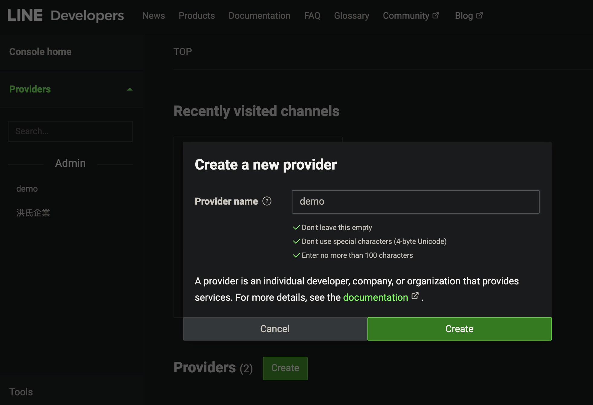

進入剛建的 provider 頁面

新建一個 channel 選擇 `Messaging API`

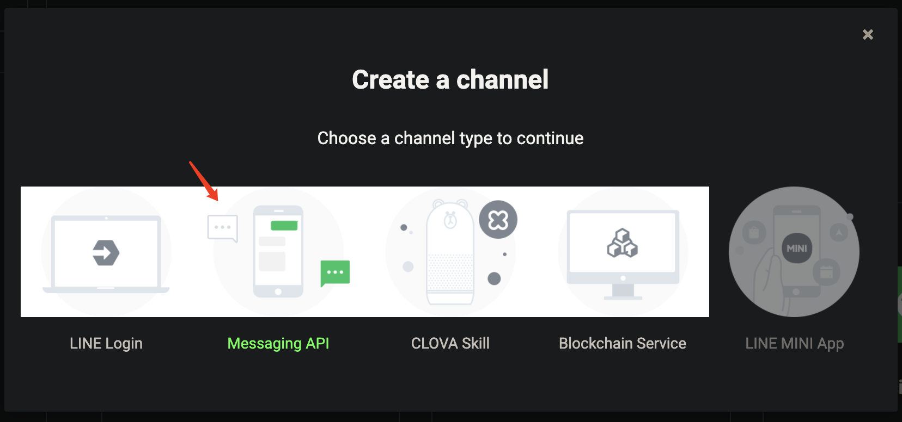

在創建 channel 頁面裡

主要需要的資訊是 channel name 聊天應用名和 channel description 簡短描述

最好設定一個 channel icon 聊天應用圖標好辨識

## 開發

### 環境變量

點擊創建之後進到應用設置的頁面

這裡需要 Basic settings 的 `Channel secret` 和 Messaging API 的 `Channel access token`

分別複製到專案目錄下 .env 檔案裡面的 `LINE_CHANNEL_SECRET` 和 `LINE_ACCESS_TOKEN`

回到應用設置的 Messaging API 中把剛啟動的專案 ngrok 外部連結貼到 Webhook URL

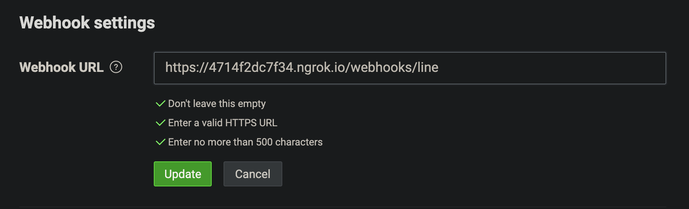

點擊驗證確認連接成功

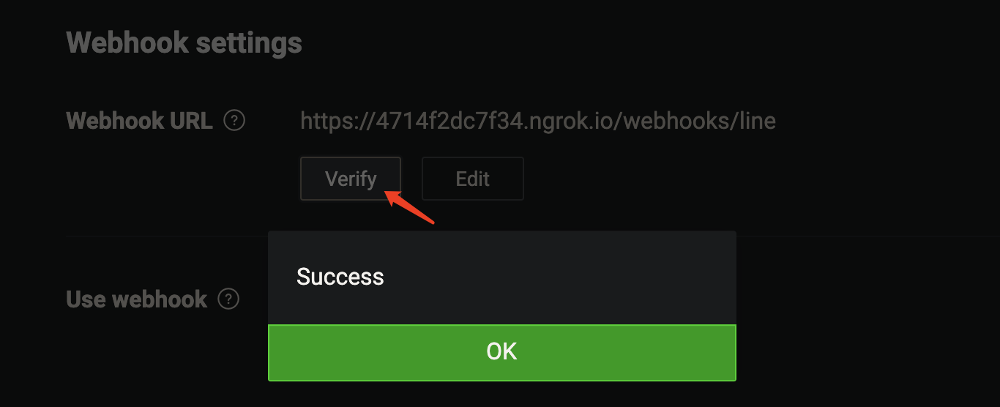

最後記得把 Use webhook 開啟

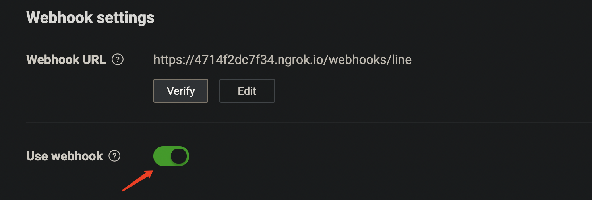

### 服務溝通

在應用設置的 Messaging API 最上面的 Bot basic ID 和 QR Code

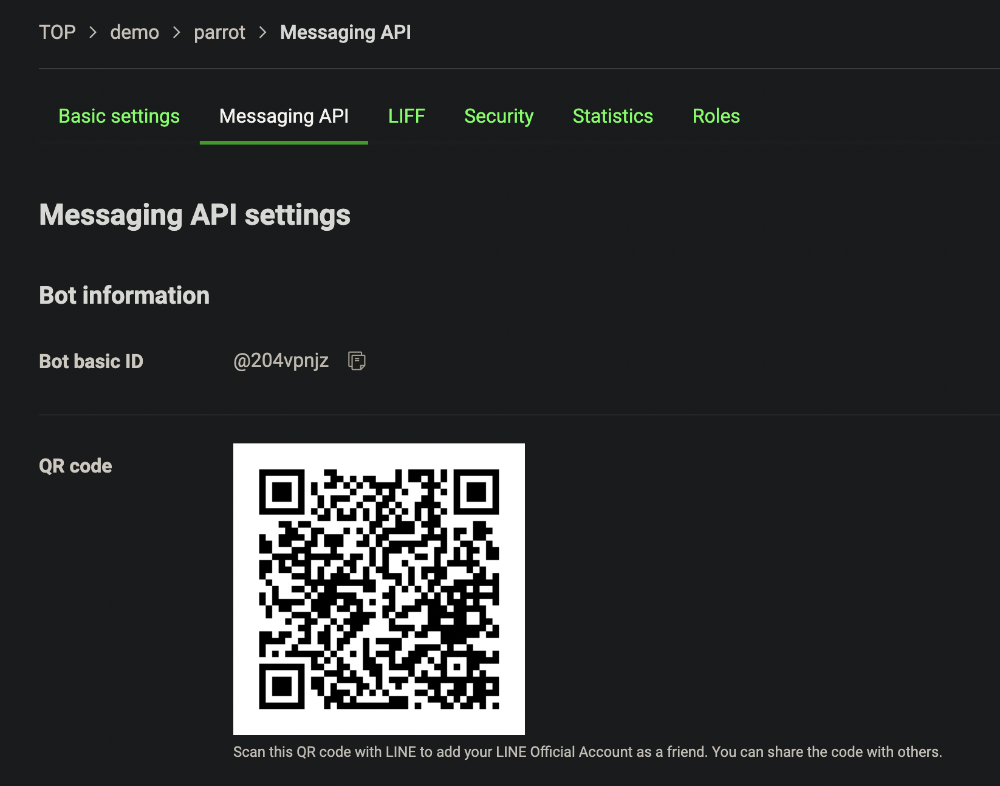

可以在 Line App 透過 ID 搜尋或掃描 QR code 加好友

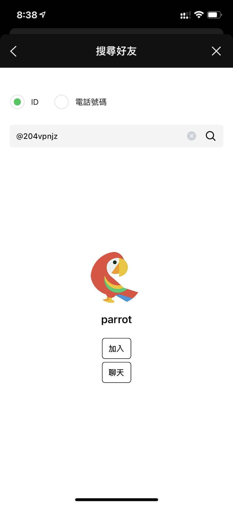

加入之後會馬上收到一個打招呼的消息

傳訊息給它除了會收到 bottender 框架預設的模版訊息

還有另外一個自動回覆的模版消息

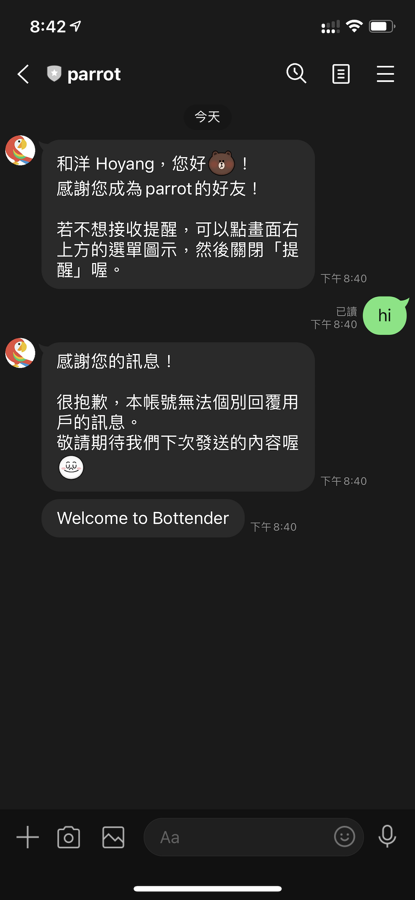

統一都在 Messaging API 裡面的 Line Official Account feature 地方修改

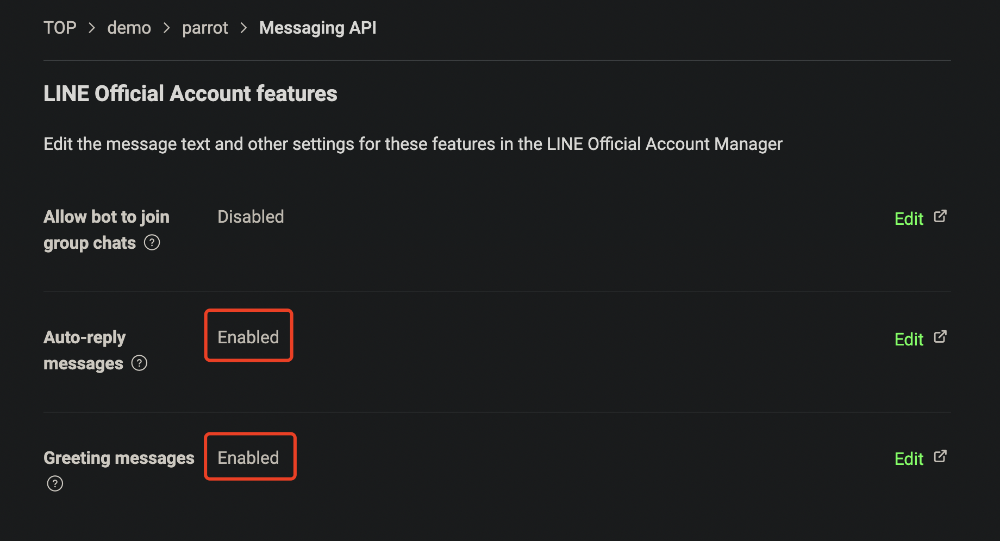

點擊編輯會跳轉 Line 官方帳號管理頁面

### 應用實作

基本上應該關掉自動回覆訊息功能

讓聊天機器人運作看起來比較正常

再傳一次訊息給它就不會有自動回覆的訊息了

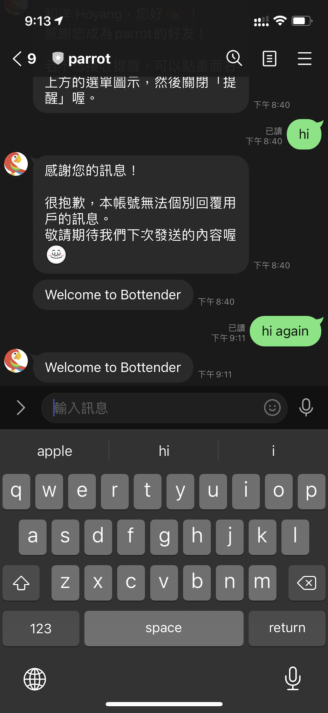

接下來我們只有簡單修改一下 `src/index.js` 的程式碼就可以完成我們的聊天機器人

```js
module.exports = async function App(context) {
  if (context.event.isText) {
    await context.sendText(context.event.text);
  } else {
    await context.sendText('我只會重複文字訊息');
  }
};
```

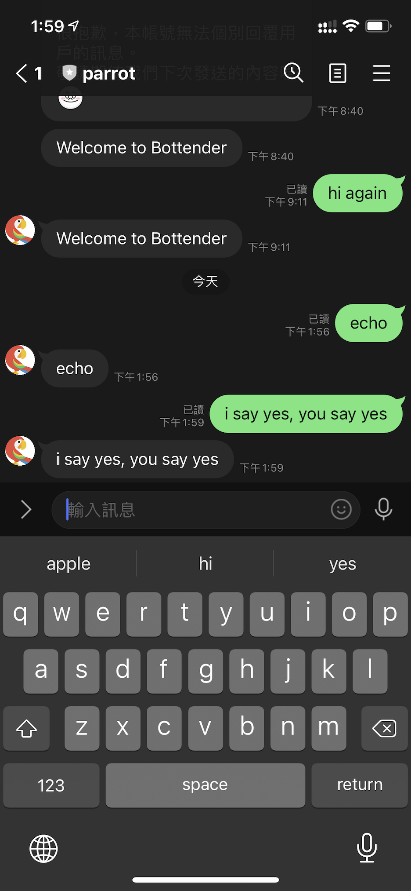

其他更複雜的應用可以參考 [bottender API 說明文件](https://bottender.js.org/docs/en/api-context)

## 佈署

最終就是要把聊天機器人發佈線上

可以使用 PaaS 雲端服務平台 [Heroku](https://www.heroku.com/home)

註冊帳號並且安裝 [Heroku CLI](https://devcenter.heroku.com/articles/heroku-cli)

Mac 可以用 [homebrew](https://brew.sh) 進行安裝

```bash
brew tap heroku/brew && brew install heroku
```

安裝完 CLI 之後可以先執行登入

```bash
heroku login
```

後續的應用上傳就可以在終端機中操作

### 新建應用

執行 `heroku create` 新建一個應用

一個免費帳戶可以免費新建 5 個應用

新建成功會得到一個 URL 和 Git 倉庫連結

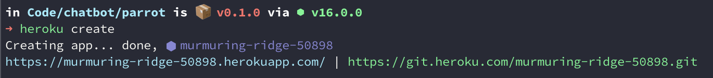

### 上傳準備

剛新建的 URL 就是替換 Line 的 Webhook URL 的線上連結

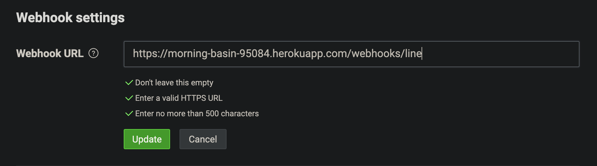

在專案的根目錄新建一個 Procfile 檔案

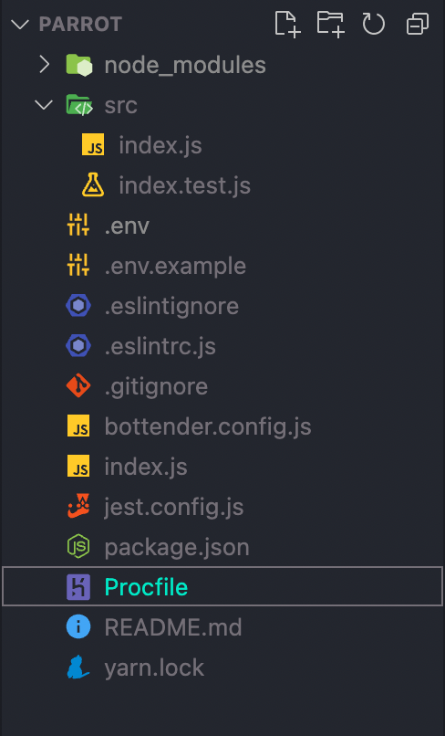

簡單設定兩個任務

```txt
web: npm start
release: echo "Y" | npx bottender line webhook set -w https://murmuring-ridge-50898.herokuapp.com/webhooks/line
```

更多設定可以參考 [The Procfile](https://devcenter.heroku.com/articles/procfile)

用 Heroku CLI 設定專案 .env 檔案的環境變量 `LINE_ACCESS_TOKEN` 和 `LINE_CHANNEL_SECRET`

```bash
heroku config:set -a <app name> LINE_ACCESS_TOKEN=xxxxx LINE_CHANNEL_SECRET=xxxxx
```

或者可以在 Heroku app 的 settings 頁面 Config Vars 設定

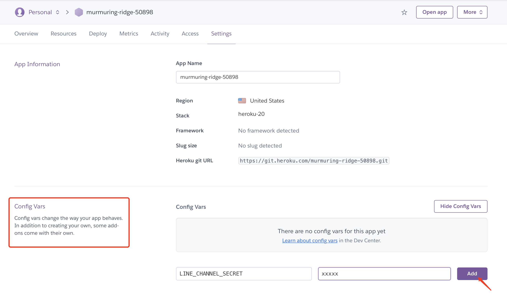

接下來就初始化專案 git

設定 Heroku git 地址

```bash
git init
git remote add heroku https://git.heroku.com/murmuring-ridge-50898.git
```

把本地程式碼推送至 Heroku 遠端倉庫

```bash
git push heroku main
```

回到 Line 再傳訊息給聊天機器人

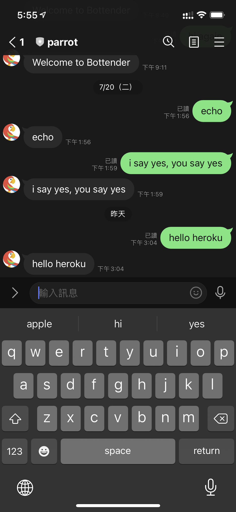

這樣就成功完成一個超簡單的聊天機器人了

## 附註

一個免費的 Heroku app 應用每個月有運行時數限制

可以執行 `heroku ps -a <app name>` 查看已經使用多久

也可以看到目前 app 的運行狀態

如果 app 超過 30 分鐘沒有人觸發就會處於休眠閒置的狀態

所以過了一段時間在呼叫它的時候反應會稍微慢一點

## Follow-up

最近開發新的聊天機器人發現跑在 Heooku 的應用，伺服器的時區為 UTC+0

像如果要修改成我的時區，需要執行以下命令

```bash
heroku config:add TZ="Asia/Taipei"
```
