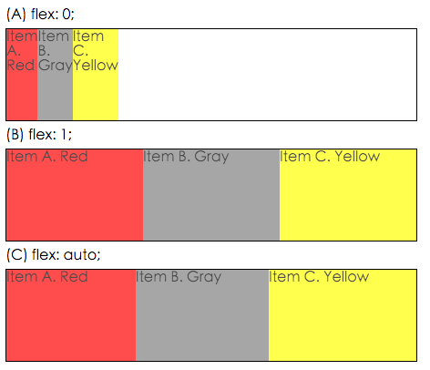
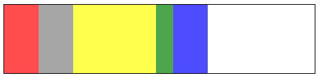

## 背景

flexible box 伸縮容器 在 caniuse 上已經有很高的支持度

為什麼要講 flexible box 而不是 flex box，因為其實 flexible box 經過好幾次的演進

<!-- more -->

從最初 2009 年的版本 `display: box` 和 `box-{*}` 的前綴屬性

到 2011 年的版本 `display: flexbox` 和 `flex()` 的函數

到最新 2012年 修訂的 CR 版本 `display: flex` 和 `flex-{*}` 的前綴屬性

但是 flexible box 最新的版本在 iOS 9 以下和 Android 4.4 以下相容性並不好

反而是 2011 年的版本在 iOS 7 - 8 和 Android 4 - 4.3 各種平台 的兼容性相對較高 (包括微信的 X5 內核)

桌上型瀏覽器更不用說，除了舊 IE 6 - 8 不看以外，主流瀏覽器都已經有支援

使用一個新的屬性(功能)最先考慮的覆蓋率 - 剛才這樣總結下來，最近兩種版本的規格兼容性已經有很高的比例

再加上 caniuse 上的 global 可使用數據已經超過 95%

問題就是如何讓它「跨版本」，最通用的解決方法就是透過 PostCSS 提供的 [autoprefixer](https://github.com/postcss/autoprefixer)

使用 flexible box 最直接的六個理由

1. 所有主流瀏覽器均支持
2. 不必擔心語法（跨版本）
3. 大部分時候只需要使用 `flex`, `justify-content` 和 `align-items` 這三種屬性
4. 簡化子元素垂直水平居中的方法， `justify-content: center` 垂直居中和 `align-items: center` 水平居中
5. 更容易地操作內嵌元素
6. 簡化複雜的布局

## 相容性

### Desktop

IE10 | IE11 | Firefox | Chrome | Safari
--- | --- | --- | --- | ---
部分支持，僅適用 2012 年語法 | 部分支持，存在多種bugs | 28 之後版本 | 21 - 28 版本 (-webkit-) <br> 29 之後版本 | 6.1 - 8 版本 (-wekkit-) <br> 9 之後版本

### Mobile

iOS Safari | Android Browser | Chrome for Android
--- | --- | ---
iOS 7 - 8.4 (-webkit-) <br> iOS 9.2 之後 | Android 2.3 - 4.3 <br> (2009年舊flexbox規格，-webkit-) <br> Android 4.4 之後版本 | 47 之後版本

* 微信 x5 內核是基於 Android 4.2 的 Webkit 533/534 (約2010年)，所以伸縮布局 (Flexbox) 屬性部分支援舊的 syntax 語法，像 `flex-item-align` 或 `flex-line-pack`，而不是加 -webkit- 前綴

  > 解決方法 - 使用 LESS/SASS mixin

### 範例

* flex: flex-grow flex-shrink flex-basis / auto / initial / inherit;

  The flex property specifies the length of the item, relative to the rest of the flexible items inside the same container.

  

* flex-basis

  flex item 基本大小，會依照父元素大小改變。預設值為auto，依照flex item元素內容而定，若無內容則為0。

  ```css
  #flex-basis #basis-demo {
    width: 450px;
    height: 100px;
    border: 1px solid #000;
    display: flex;
    display: -webkit-flex;
    margin-top: 10px;
  }
  #flex-basis #basis-demo > div {
    flex-basis: 50px;
    -webkit-flex-basis: 50px;
  }
  #flex-basis #basis-demo #demo3 {
    flex-basis: 120px;
    -webkit-flex-basis: 120px;
  }
  #flex-basis #basis-demo #demo4 {
    flex-basis: 25px;
    -webkit-flex-basis: 25px;
  }
  ```

  

## 已知問題

* 在 IE10 和 IE11 中， 容器設置 `display: flex` 和 `flex-direction: column`，如果容器設定 `min-height` 而沒有定義 `height`，則不會計算子元素固定的寬高

  > 解決方法 - 使用 `height` 來替代 `min-height`

* 在 Chrome, Firefox, Safari 和 Edge 都出現過問題，一些 HTML 元素無法為伸縮容器，像 `<fieldset>` 和 `<button>` 無法像伸縮容器一樣運作。

  > 最簡單解決的方法，使用一個可以是伸縮容器的包裹元素 (像 `<div>`) 直接在這些元素裡面。

* 在 IE10 中 flex 屬性默認值 `0 0 auto` 而不是最新規格的默認值 `0 1 auto`

  > 最好的解決辦法是，如果要支持IE10 永遠在伸縮容器上清楚的設定 `flex-shrink` 值，或永遠在 `flex` 宣告式中使用完整格式而非簡短格式。

  | 宣告式 | 默認標準 | IE10 |
  | --- | --- | --- |
  | 沒有宣告 `flex` | `flex: 0 1 auto` | `flex: 0 0 auto` |
  | `flex: 1` | `flex: 1 1 0%` | `flex: 1 0 0px` |
  | `flex: auto` | `flex: 1 1 auto` | `flex: 1 0 auto` |
  | `flex: initial` | `flex: 0 1 auto` | `flex: 0 0 auto` |

* 在 Firefox 嵌套伸縮容器不向其他伸縮項目應該對齊到基準線

  > 解決方法 - 此問題只影響設定 `display: flex` 的嵌套元素，如果嵌套元素設定為 `display: inline-flex` 會如預期運行

* 在 IE10 的伸縮容器中設置 `-ms-flex-flow: row wrap` 元素中的內容不會斷行，除非在子元素設置 `display: inline-block`

* 在 IE11 的伸縮容器無法使用偽元素
