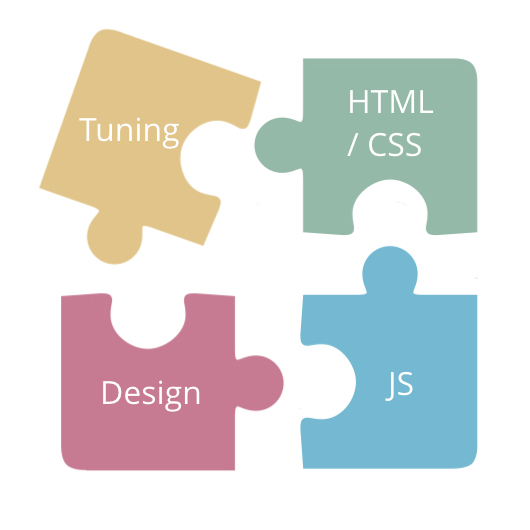
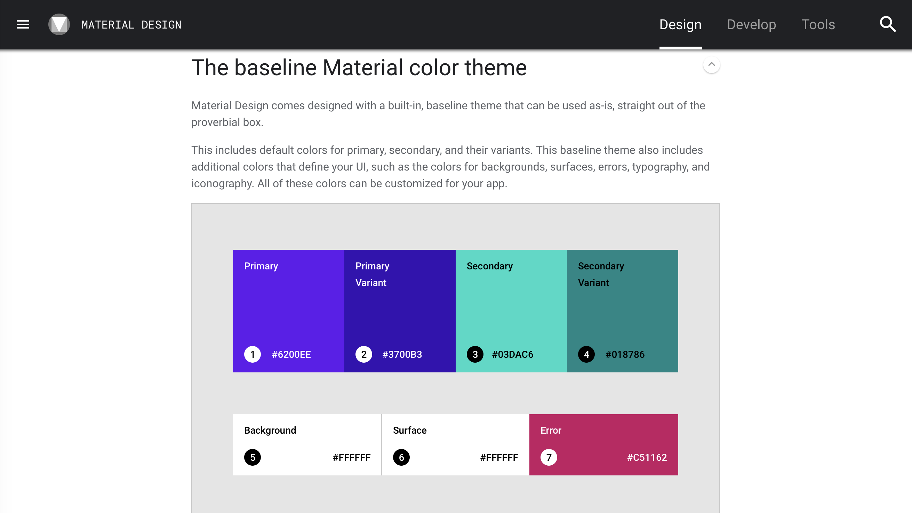
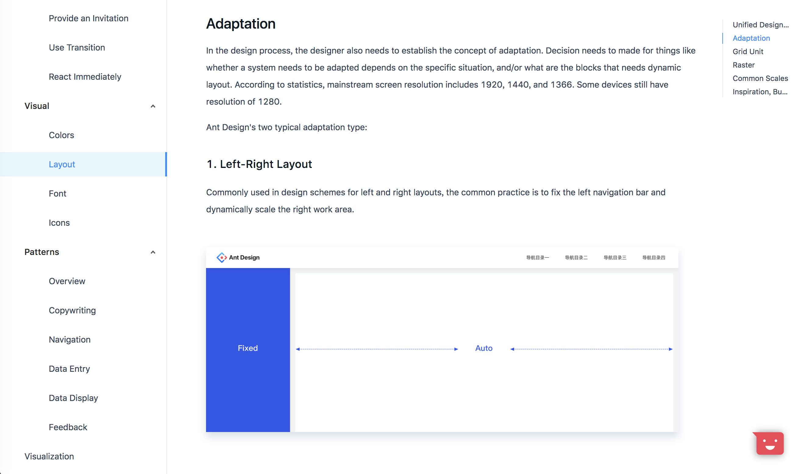
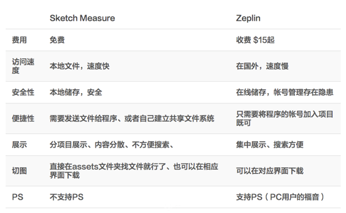
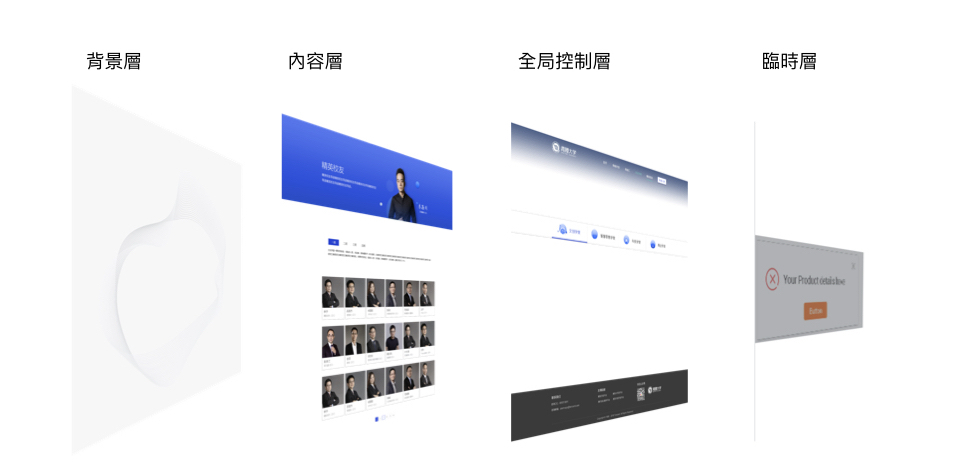
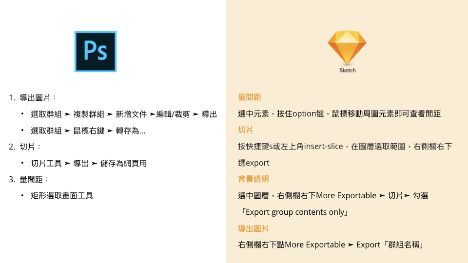
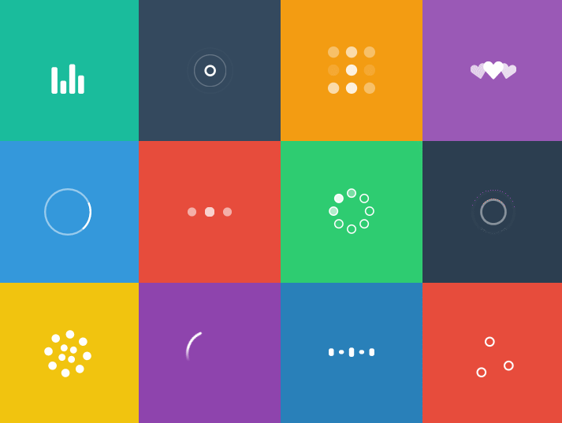
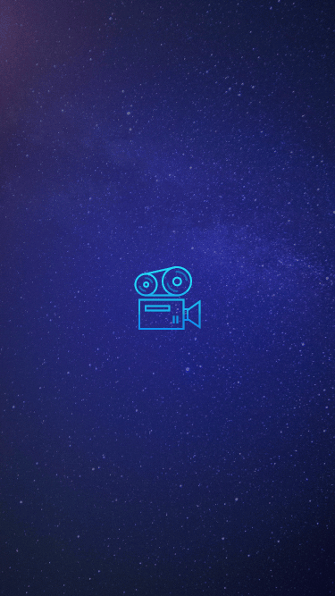
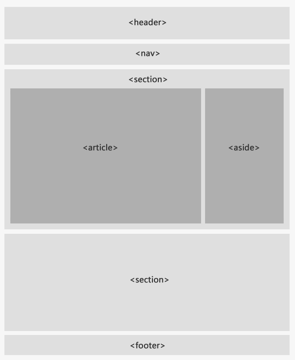

## 零基礎掌握大前端的技能

什麼是大前端？

雖然是個很常聽到的詞，但是看了一下網上的資料，其實也沒有定義的很明確  
透過手邊的資料跟自己的理解  
總結出大前端需要具備這幾個能力

<!-- more -->

首先是「JS編程能力」，這是身為前端開發都具備的能力  
而設計知識基礎、重構能力和調教能力這三個方面是比較弱的部分



這篇文章主要著重在「設計」這個方向

## 設計規範

說到設計，在產品應用層面來說  
就像開發有代碼的規範，設計也會有對應的設計規範，都是為了保證產出物的品質  
一般來說設計團隊會根據經驗與項目，總結出來的一套屬於自己的設計規範  
了解了下目前幾個比較廣為人之的設計規範，像是 Material Design, Ant Design...等  





設計規範其中包含了這幾個方面

- 配色：包含產品的主色調、控件顏色、狀態顏色...等等
- Layout：包含PC端與Mobile端的Layout
- 字體：字型、字號、字色、以及行高
- Icon：對於比較多icon使用場景的業務，會規範 icon 的大小、各種狀態色值
- 間距
- … 等等

## 設計輸出

有了一套設計規範後，設計團隊會根據設計規範輸出設計稿給到開發。  
在開發過程中，第 一個遇到的狀況是「如何準確進行視覺還原？」  
大部分的設計師使用的都是 PS 或 Sketch 來進行繪製設計稿

而近期又以 Sketch 為流行使用，其中一個原因是一些插件把設計與開發溝通的橋樑串接起來

像是以下兩個插件，可以將設計稿導出成瀏覽器可預覽的視覺

- Sketch Measure
- Zeplin

但是這兩個插件的功能有稍微的不同，比較如下圖



Sketch Measure 和 Zeplin 最大的差異在於 Measure 只支援 Sketch，而且免費  
既然已經有 Sketch Measure 或 Zeplin 這些 Plugins，為什麼還要學習 PS 以及 Sketch 的基本技巧？

以下是以 Sketch Measure 為出發點做比較

- 不支援導出 PNG 以外的格式，包含 SVG 等常用格式（必須使用 Sketch 內建的導出圖片功能）
- Sketch 是一個更新頻率很高的軟體，如果Plugin更新的速度跟不上，在 Sketch 更新之後可能會有些問題，導致無法正常使用
- 設計師不一定使用 Sketch 做頁面設計
- 據自己了解和過往經驗，在許多團隊中設計師只提供設計稿並不做切圖的動作，基本上的切圖與一些設計稿的操作是 UI 開發需要自行處理，因此我認為我們要往大前端的方向，基本的設計軟體操作技巧還是要掌握

## 視覺還原

有了以上的基本的設計知識，開始來說拿到設計原稿後如何進行實踐，第一步先進行設計拆解

### 設計拆解

主要有兩個步驟：

1. 設計拆解

  

2. 交互確認：了解設計師最終想要呈現的效果

  

然後就可以開始對設計稿的圖片資源進行導出

### 圖片處理

底下這張圖是我將 PS 與 Sketch 幾個常見的操作所做的整理



詳細操作步驟可以參考 <a href="assets/ps&sketch.pdf" target="_blank">PS 和 Sketch 詳細切圖操作步驟 <i class="fas fa-external-link-alt"></i></a>

至於要導出什麼格式、以什麼方式實踐，如下述

- 圖片格式：

  - jpg 格式 - banner或矩形圖片等顏色豐富，壓縮率高
  - png 或 svg 格式 - 半透明，或需要適應不同背景的icon圖標

- 圖片壓縮：

  - jpg 壓縮 - PS或Sketch中導出時壓縮到85%
  - png 壓縮 - 推薦 [TinyPNG](https://tinypng.com/)

- 圖片合併：

  - Sprite 雪碧圖

- 加 lazyload 懶加載，優化用戶等待體驗

### 圖片格式

#### Base64

這類圖片從誕生起，基本上很少被更新。  
適用場景：這類圖片的實際尺寸很小


```css
background: url(data:image/png;base64,iVBORw0KGgoAAAANSUhEUgAAACcAAAAnCAMAAAC7faEHAAAAM1B
MVEUAAAD///////////////////////////////////////////////////////////////+3leKCAAAAEHRSTlMA3dKElohES/fBfT7n
cFA4OSNapAAAAHxJREFUOMvt0MsKgCAUBuFjlt3L93/aFiUjCL9Iq6BZf6uxIWu3u6HosJjVPS4W9Q3OhdT5uJA3J9eZ
ykdchc04xfyIU8xwkuEkw2mG0wwnmHQw6WDSwbSDaQfTDqbdAssq3TrBCAdcTDr6mAvOee34/LvXbnKVttvVa3A
XnU0WqafEyB4AAAAASUVORK5CYII=) no-repeat;
```

| 優點 | 缺點 |
| ----- | ----- |
| 減少了HTTP請求 | IE 6/7 瀏覽器不支持 |
| 某些文件可以避免跨域的問題 | 根據 base64 的編碼原理，尺寸比原文件要大，如果圖片稍微有點大，這個字符串會很長很長 |
| 圖片更新後，要清緩存的問題 | 因為瀏覽器緩存是針對文件，所以只能緩存包含 base64 的文件，比如 HTML / CSS，這相比緩存圖片要弱的多 |

#### SVG

SVG 圖片 [教程](https://www.w3cplus.com/svg-tutorial?page=1)

- 矢量，放大不失真，可適配各種分辨率
- 支持多色
- 支持動畫



SVG 壓縮 - <https://jakearchibald.github.io/svgomg/>

#### WebP

WebP 是一種支持有損壓縮和無損壓縮的圖片文件格式，根據 Google 的測試，無損壓縮後的 WebP 比 PNG 文件少了26％的體積，有損壓縮後的 WebP圖片相比於等效質量指標的 JPEG 圖片減少了25％~34%的體積。

- 無損壓縮：webp ≈ png * 26%
- 有損壓縮：webp ≈ jpg * 25% ~ 34%

#### APNG

基於 PNG 格式擴展的一種動畫格式，增加了對動畫圖像的支持，同時加入了 24 位元 圖像和 8 位元 Alpha 透明度的支持

這意味著動畫將擁有更好的質量，其誕生的目的是為了替代老舊的 GIF 格式
​
使用 GIF 效果


使用 Apng 效果



#### Iconfont

用字體庫當圖標庫

### 頁面布局

#### Class命名

頁面 - 模塊 - 元素，例：

```css
.page-user .block-card .el-title { ... }
```

  > 可參考BEM、SMACSS…等命名方法

### 標籤語義化

語義標籤取代 Div



### 適配方案


根據不同的需求，可以依照上面列出來的幾種方式去挑選合適的適配方案。
值得一提的是Bootstrap是一套兼容PC至移動端響應式的套件，很適合拿來用在 缺少設計資源或後台管理網站
另外，根據實際情況的不同頁面布局是可以混著用
根據過往開發經驗，個人建議，大區塊用自適應，間距才用rem，因為rem換算出來有小數點，所以會有誤差

### 全屏適配

rem.js - 透過設備的分配率和DPI等參數，計算比例實踐全屏適配。
