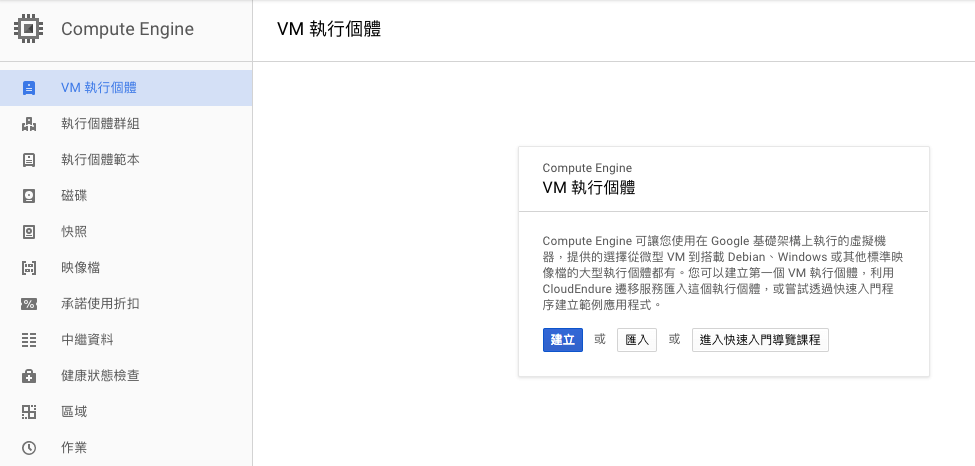
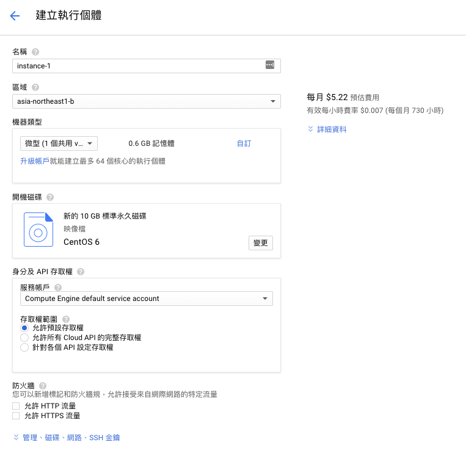
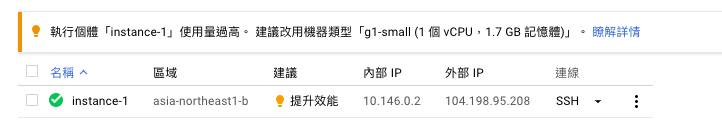
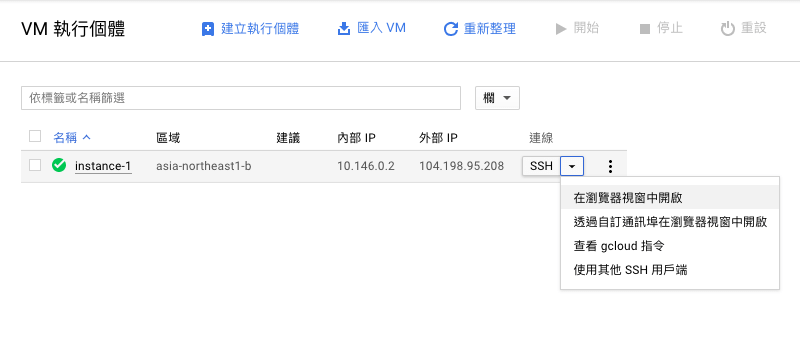
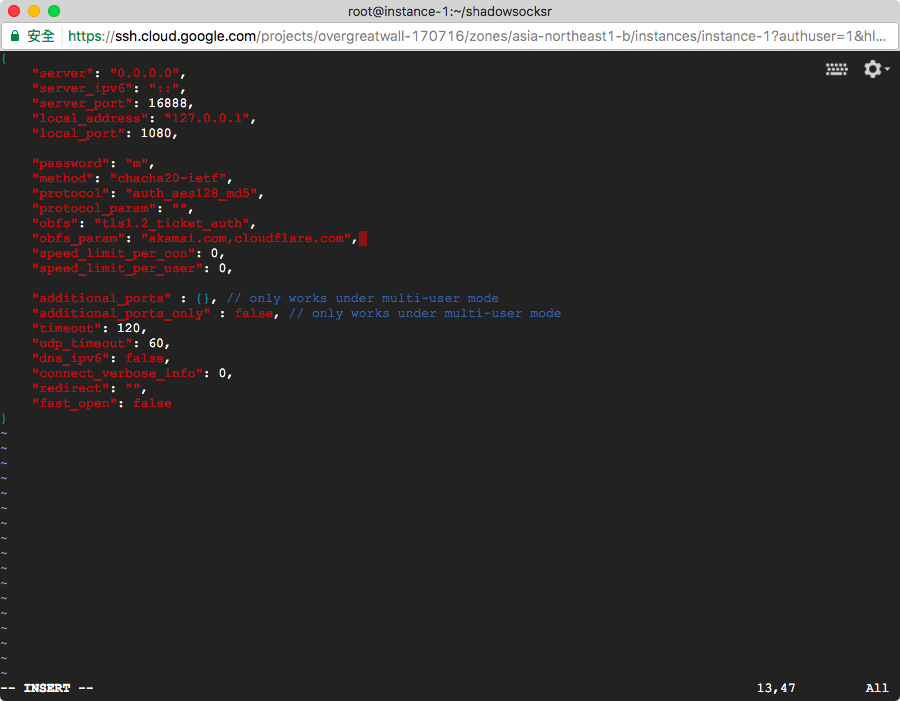
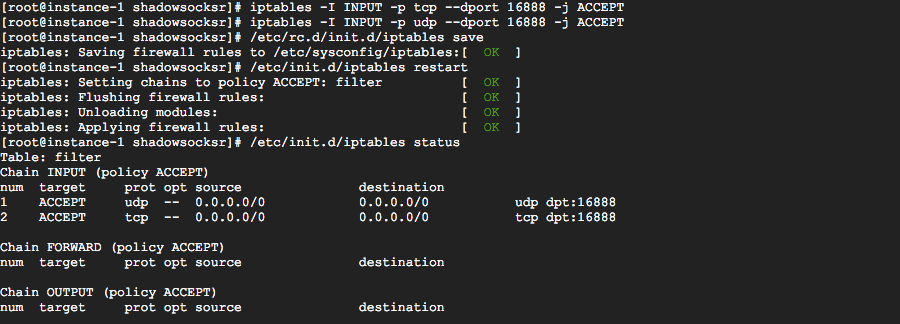
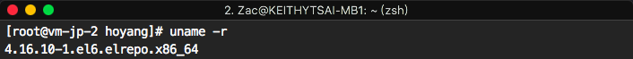
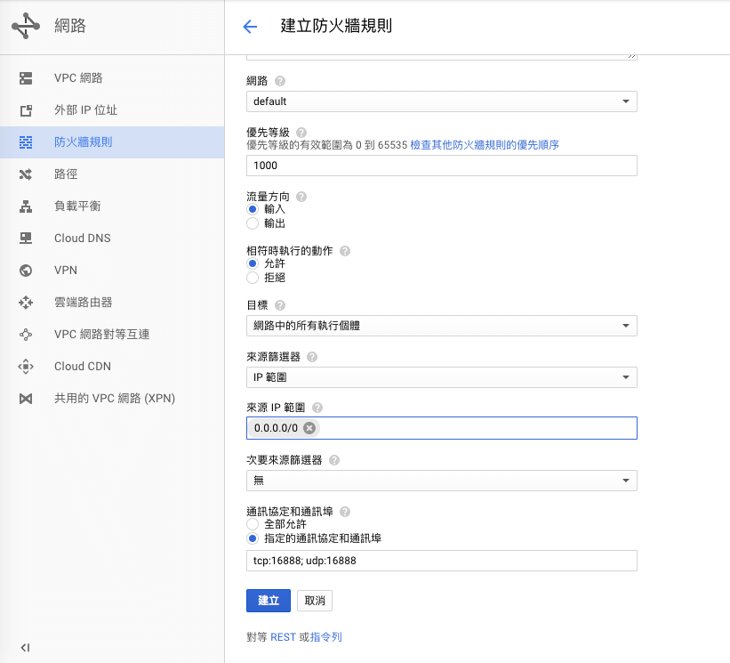
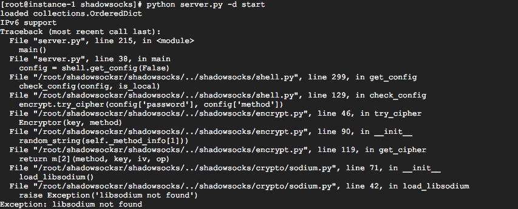

近幾年雲服務市場競爭激烈 <br>
從一開始的亞馬遜 AWS，接著微軟的 Microsoft Azure <br>
到最後 Google 也跳進來做 Google Cloud 谷歌雲服務 <br>
直接推出最優惠的試用方案: <span class="hi-red">一年免費試用，再送 300 美元試用額度</span> <br>
只要有 Google 帳號就可以馬上來申請 [freetrial](https://console.cloud.google.com/freetrial) <br>

<!-- more -->

## 建立 VM 執行個體

申請完成後 <br>
直接進入 [Google Cloud 主控台](https://console.cloud.google.com/) 建立一個新的專案，專案名稱可以隨便取


再到專案中的 Computer Engine 建立 VM 執行個體



* 名稱：名稱隨便取，像 instance-1
* 區域：如果是要翻牆，建議選 asia-northeast 或 asia-east
  > 亞洲區的分別在
  >
  > 1. asia-northeast -> 日本
  > 2. asia-east -> 台灣
  > 3. asia-southeast -> 新加坡
  >
  > 其他區域: [https://cloud.google.com/about/locations](https://cloud.google.com/about/locations)
* 機器類型：微型
* 開機磁碟：CentOS 6
* 身分及 API 存取權，不用修改
* 防火牆，不用修改
* 網路用預設的，系統會自動配一個臨時 IP 位址
  > IP 用臨時就可以了，因為一個專案每一個區域只能申請一個免費的固定 IP



機器類型選擇微型，是因為只是要用 ShadowsocksR 服務不需要太多電腦運算能力，而且價差非常的大。

之前建立一個 VM 在使用幾天後，Google Cloud 平台就建議將微型 vCPU 升級到小型，用了一個月後試用額度也從 300 USD 扣到只剩 220 USD 左右 (當然也跟我每天晚上都看 youtube 也有關係)

後來我發現... Google Cloud 有個更大的陰謀 <br>
就是我建立一個 VM 執行個體，在沒有運行任何程式的情況下 <br>
過幾天再登入，居然也出現「提升效能」的建議，所以真的可以不用理會平台的升級建議



## 下載 ShadowsocksR 源碼

建立完成後，在瀏覽器視窗中開啟



登入 console 直接切換管理者角色 `sudo su` <br>
避免之後安裝套件或執行程式權限不足

更新一下套件中心 `yum update -y`

因為 <a href="https://github.com/shadowsocksr-backup/shadowsocksr">ShadowsocksR</a> 要從 github 下載 <br>
(08/20/2017 更新：先前的 repo 不知什麼原因刪除了，重新在 github 上面找到備份版本，同時我也在 GitLab <a href="https://gitlab.com/hoyangtsai/shadowsocksr">備份</a> 一個，避免之後又不見。)

先安裝 git 工具 `yum install git -y`

再下載 ShadowsocksR 源碼

```bash
cd ~ && git clone https://github.com/shadowsocksr-backup/shadowsocksr.git && cd shadowsocksr && git checkout -b manyuser origin/manyuser
```

下載完後 <br>
執行 `bash initcfg.sh` 自動生成初始配置檔案

用 `vim user-config.json` 編輯使用者配置

```js
{
    "server": "0.0.0.0",
    "server_ipv6": "::",
    "server_port": 3888, // 任何 0 - 65535 port
    "local_address": "127.0.0.1",
    "local_port": 1080,

    "password": "", // shadowsocksr 客戶端登入密碼
    "method": "aes-256-cfb", // 加密方式
    "protocol": "auth_aes128_md5", // 加密協議
    "protocol_param": "",
    "obfs": "tls1.2_ticket_auth_compatible",
    "obfs_param": "akamai.com,cloudflare.com", // 混淆參數 akamai.com,cloudflare.com

    // 其他保留預設
}
```



## 設定 iptables

將上面 user-config.json 設定的 server_port ，同樣設定到系統的 iptables 對應輸入的埠

```bash
iptables -I INPUT -p tcp --dport <server_port> -j ACCEPT
iptables -I INPUT -p udp --dport <server_port> -j ACCEPT
```

儲存設置，重新啟動 iptables

```bash
/etc/rc.d/init.d/iptables save
/etc/init.d/iptables restart
```

執行 `/etc/init.d/iptables status` 檢查設定是否成功



其他 iptables 指令說明 <https://www.digitalocean.com/community/tutorials/how-to-list-and-delete-iptables-firewall-rules>

## 安裝 BBR

```bash
wget --no-check-certificate https://github.com/teddysun/across/raw/master/bbr.sh
chmod 755 bbr.sh
./bbr.sh
```

啟動時，程式會要求按任何鍵確認開始執行安裝，安裝過程會花比較長的時間 <br>
安裝完成後，一樣會要求使用者按 y 確認執行重新開機

重新開機後，再次連接登入系統執行 `uname -r` 確認有更新到 4.10 以上即可



## 新增防火牆規則

根據上面 user-config.json 設定的 server_port，開啟對外 ip 輸入，對應的 tcp 和 udp 埠



## 啟動 SSR 服務

全部完成後就可以啟動 SSR server

```bash
cd ~/shadowsocksr/shadowsocks && python server.py -d start
```

啟動 BBR

```bash
sysctl net.ipv4.tcp_available_congestion_control
sysctl net.ipv4.tcp_congestion_control
sysctl net.core.default_qdisc

## 驗證 BBR 是否運行
lsmod | grep bbr
```

## 安裝客戶端

* Mac 系統，推薦 [ShadowsocksX-NG](https://github.com/shadowsocks/ShadowsocksX-NG/releases)
* iOS 系統，推薦 [Shadowrocket](https://itunes.apple.com/app/shadowrocket/id932747118)
* Android 系統，推薦 [shadowsocksr-android](https://github.com/shadowsocksr-backup/shadowsocksr-android/releases)

對照 user-config.json 設定客戶端即可 **打完收工**

## 備註

如果是使用 chacha20-ietf 加密方法 <br>
直接啟動 SSR server 會出現 'libsodium not found' 的錯誤



需要安裝 libsodium 套件

```bash
yum -y groupinstall "Development Tools"
wget https://github.com/jedisct1/libsodium/releases/download/1.0.12/libsodium-1.0.12.tar.gz
tar zxf libsodium-1.0.12.tar.gz && cd libsodium*
./configure && make && make install
echo /usr/local/lib > /etc/ld.so.conf.d/usr_local_lib.conf
ldconfig
```
