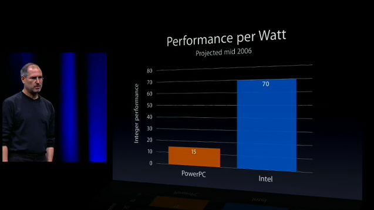
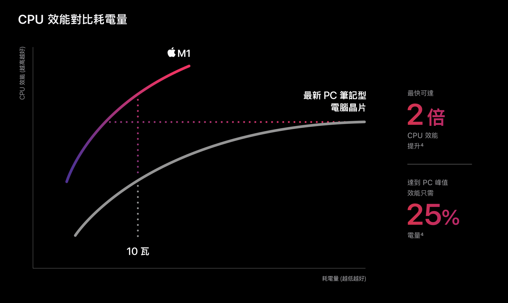
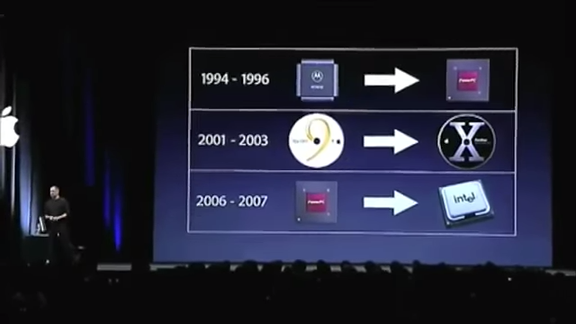
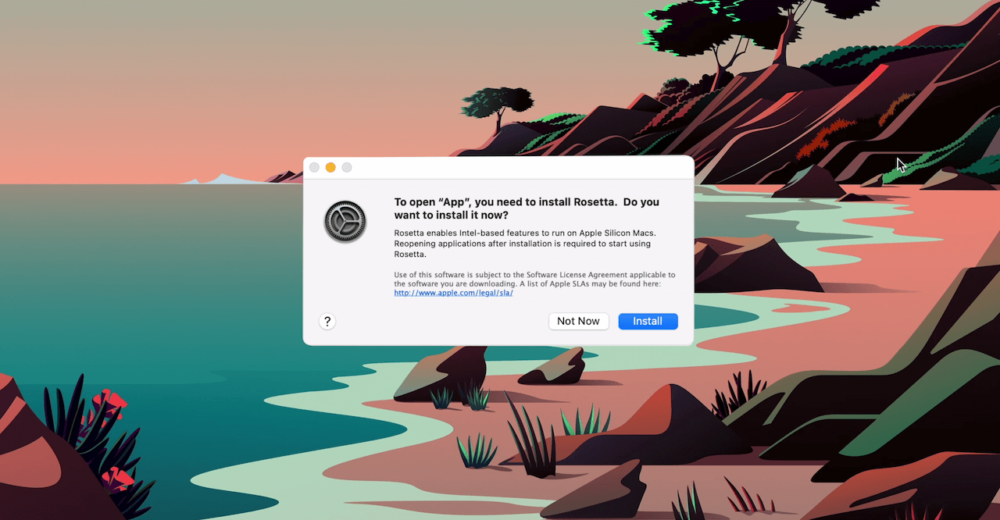

從 2009 年 MacBook 開始踏入 Mac OS 這個領域

沒有參與過 PowerPC 轉換 Intel 這個歷史時刻

MacBook 是從 2006 年開始進行這次的轉換

Intel 環境支援已經算完整

<!-- more -->

也是因為當時筆電的設計

鋁合金機身和 Mac OS 使用體驗讓我從此愛上蘋果電腦

回顧 WWDC 2005 賈伯斯簡單解釋為什麼轉換 Intel 晶片

主要是電源效能

> Apple WWDC 2005

直到現在為什麼又從 Intel 切換回 arm 晶片

也是因為 power efficiency

更小的功耗、更快的處理效能

> [Apple.com](https://www.apple.com/tw/mac/m1/)

在 WWDC 2005 也提到從 PowerPC 遷移至 Intel

Apple 即將進入第三次的轉換

> Apple WWDC 2005

第二次屬於軟體系統架構的升級

排除軟體的轉換

身為果粉肯定不能錯過第三次的硬體的轉換

更何況蘋果的電腦已經從我讀書的工具成為我生財的工具

現在是靠 Macintosh 麥金塔系統開發程式

我不開發 iOS / Ｍac Apps 但是因為 unix-like 確實是比較開發友好的系統

說到身為一個軟體開發者

我看了很多的 M1 晶片的評測影片

大部分都談論剪片有多順、影片導出有多快

比拼最新的 MacBook 16" 或甚至 Mac Pro 的

對我來說實際意義不大

當第一次開啟 Intel 版本 App 詢問是否安裝 Rosetta

一旦安裝 Rosetta 之後

很難分辨正在使用的 App 是 made for Intel or made for Apple silicon

everything it just works 操作很流暢

我覺得對普羅大眾來說比較有感的是

- 鍵盤輸入感受
- 電池續航力

## 鍵盤輸入

我上一台 MacBook 是公司提供的最基本款的 2017 MacBook Pro 13" 256GB 硬碟 / 8GB 記憶體

鍵盤是不知道第幾代的 butterfly keyboard 蝶式鍵盤

Apple 很努力想改進他們所謂更輕薄的鍵盤

但是輸入體驗依舊是很難打

所以在新版的 M1 晶片 MacBook Pro / Air 改回傳統式的剪刀式鍵盤

輸入體驗上更輕彈好按

## 電池續航力

在印象中 2009 年的第一台 MacBook 確實相較之前的 Windows 筆電續航更久

大概有 2 ~ 3 小時的電池續航

而那時候的 Windows 筆電有個 2 小時就要偷笑了

但是不知道是不是因為現在我都是用電腦做工作量更多的事

每次發佈會上說的電腦都會有什麼 6 小時的電力續航

我實際用下來都大概只有 2 ~ 3 小時

沒什麼進步

直到我換到這台 MacBook Air M1 使用才感受到什麼叫真的叫低工耗

在工作量大的情況下可以有 6 小時以上的使用時間

如果只是在咖啡廳瀏覽網站、聽音樂、讀/寫文件一整天

現在可以很肯定的說不需要帶充電器出門

我上一台自己的 MacBook Air 是 2014 年 13吋版本

升級到 MacBook Air M1 超級有感

多了獨立喇叭、TouchID

優點

- 電池續航久
- 流暢
- 操作速度快
  - 文件變更
  - 執行程式
- 可攜性更高，使用一整天不需要帶充電器
- 鍵盤好打，新的剪刀鍵盤而不是難打的蝶式鍵盤
- 如果是買 MacBook Air  沒有 Touch bar 但速度沒有犧牲
- 可以執行部分 iOS App

缺點

- 少部分 app 會閃退，甚至 Proxifier 會導致系統無預警重啟
- 遇過一次進入螢幕保護之後無法喚醒
- 蘋果第一台 ARM 架構電腦，後面會有效能更強大的機器陸續推出

## Updates

如果可以等的人可以期待2021年的 Mac 電腦更新

最近看到的爆料

- 會有 14" 和 16" 吋 Arm 版本的 MacBook Air/Pro
- 外型會有新的設計，像是 iPhone 12 平面設計？！
- 螢幕更亮、對比度更高，使用 Micro-LED
- 比現在最多 4 個 Thunderbolt 雷電接口，更多類型的接口，像是 SD Card 或 HDMI
- 充電將回歸 MagSafe 磁吸設計
- 移除 Touch Bar
- 其他機型 iMac 將會有全新的設計
