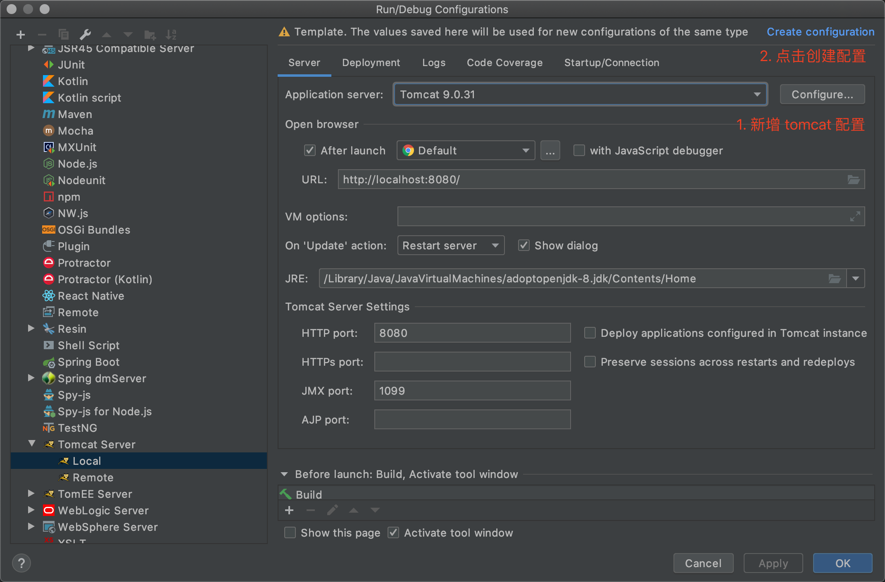
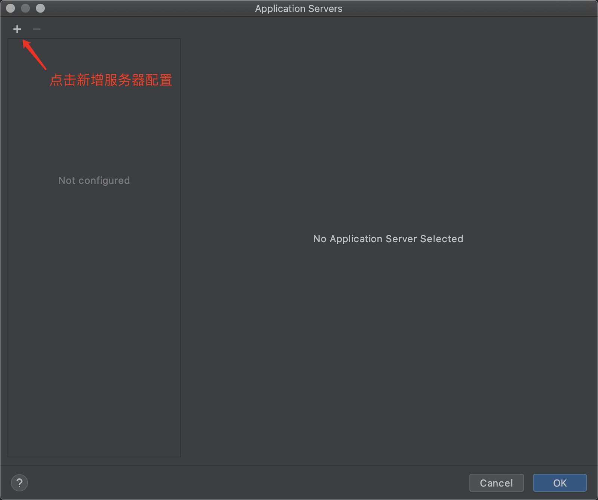
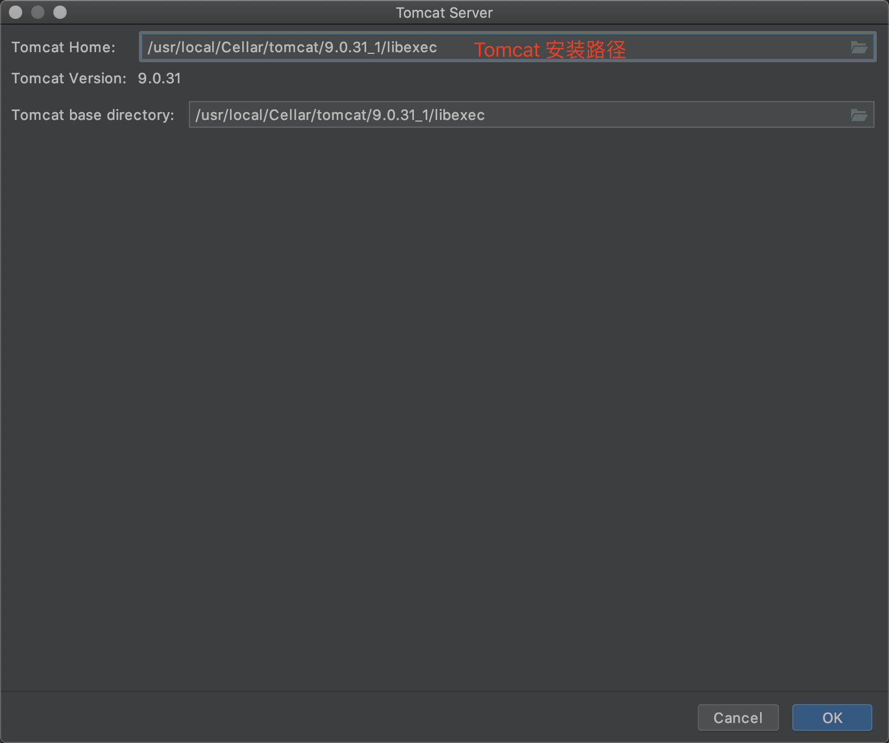
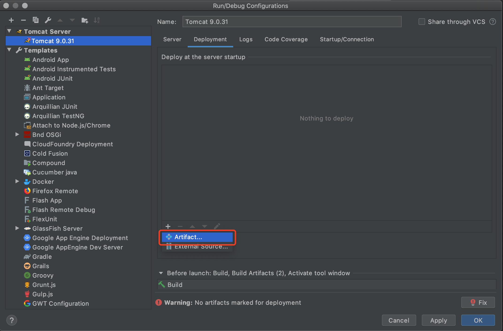
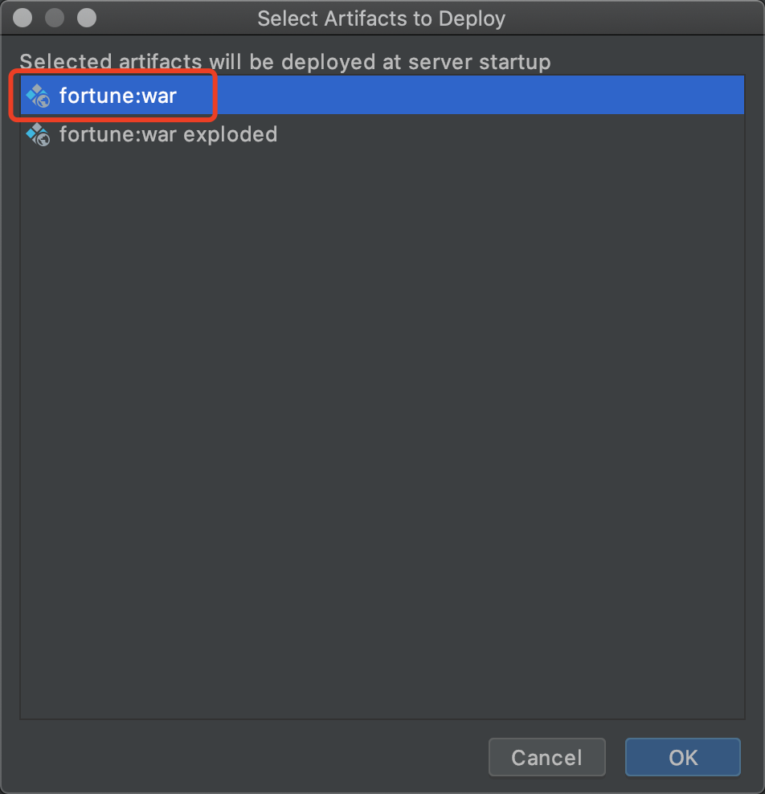
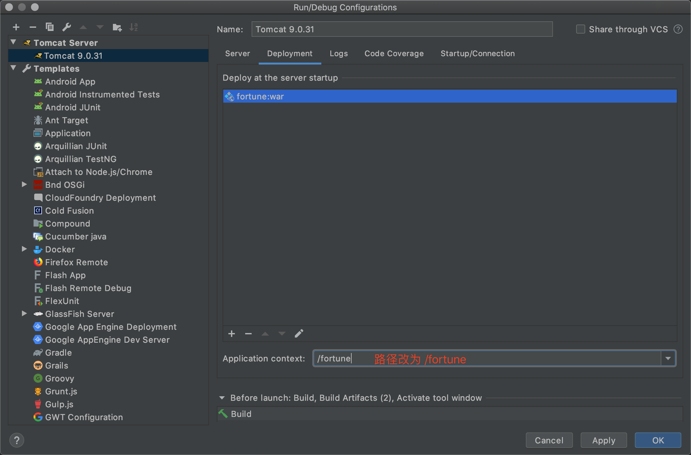
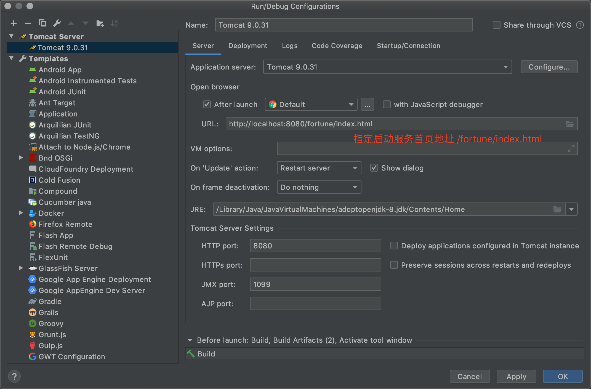

## 環境設置

### 安裝 JAVA SDK

CentOS 用下面指令安裝 JDK 版本

```bash
yum install java-1.8.0-openjdk-devel
```

<!-- more -->

執行 `java -version` 檢查版本

順帶一提，如果安裝多個 JAVA 版本，可以用下面命令切換 JAVA 版本

```bash
alternatives --config java
```

MacOS 使用 Homebrew 安裝

```bash
brew tap adoptopenjdk/openjdk
brew cask install adoptopenjdk8
```

可以透過修改環境變量 `.bash_profile` 或 `.zshrc` 更換版本

```bash
export JAVA_HOME=$(/usr/libexec/java_home -v 1.8)
export JAVA_HOME=$(/usr/libexec/java_home -v 9)
```

### 新增環境變量

默認 java 安裝路徑在 `/usr/lib/jvm/java-1.8.0`

在 `~/.bashrc` 或 `~/.bash_profile` 新增以下內容

```bash
JAVA_HOME=/usr/lib/jvm/java-1.8.0
JRE_HOME=$JAVA_HOME/jre
CLASSPATH=.:$JAVA_HOME/lib/dt.jar:$JAVA_HOME/lib/tools.jar:$JRE_HOME/lib
PATH=$JAVA_HOME/bin:$JRE_HOME/bin:$PATH
export JAVA_HOME JRE_HOME CLASSHOME PATH
```

更新環境變量

```bash
source ~/.bashrc
```

### 檢查 tomcat 配置

到 tomcat 目錄的 bin 路徑下，使用 `./configtest.sh` 檢查配置，前幾行應該看起來像下面配置

```bash
[root@VM_centos /etc/tomcat/bin]$ ./configtest.sh
Using CATALINA_BASE:   /etc/tomcat
Using CATALINA_HOME:   /etc/tomcat
Using CATALINA_TMPDIR: /etc/tomcat/temp
Using JRE_HOME:        /usr/lib/jvm/java-1.8.0/jre
Using CLASSPATH:       /etc/tomcat/bin/bootstrap.jar:/etc/tomcat/bin/tomcat-juli.jar
...
```

### 安裝 Maven

```bash
yum install maven
```

maven 默認安裝在家目錄的 `.m2/` 路徑下

在安裝路徑下新增 `~/.m2/settings.xml`

視開發環境情況設定 mirror 鏡像、proxy 代理、第三方 repository 庫

```xml
<settings xmlns="http://maven.apache.org/SETTINGS/1.0.0"
          xmlns:xsi="http://www.w3.org/2001/XMLSchema-instance"
          xsi:schemaLocation="http://maven.apache.org/SETTINGS/1.0.0 http://maven.apache.org/xsd/settings-1.0.0.xsd">
  <mirrors>
    <mirror>
      <id>nexus-tencentyun</id>
      <mirrorOf>central</mirrorOf>
      <name>Nexus tencentyun</name>
      <url>https://mirrors.tencent.com/nexus/repository/maven-public/</url>
    </mirror>
  </mirrors>
  <proxies>
    <proxy>
      <id>httpproxy</id>
      <active>true</active>
      <protocol>http</protocol>
      <host>IP OR Domain</host>
      <port>PORT</port>
      <username></username>
      <password></password>
      <nonProxyHosts>localhost|127.0.0.1</nonProxyHosts>
    </proxy>
    <proxy>
      <id>httpsproxy</id>
      <active>true</active>
      <protocol>https</protocol>
      <host>IP OR Domain</host>
      <port>PORT</port>
      <nonProxyHosts>localhost|127.0.0.1</nonProxyHosts>
    </proxy>
  </proxies>
  <profiles>
    <profile>
      <activation>
        <activeByDefault>true</activeByDefault>
      </activation>
      <repositories>
        <repository>
          <id>tencent</id>
          <url>https://mirrors.tencent.com/nexus/repository/maven-public/</url>
          <releases>
            <enabled>true</enabled>
          </releases>
          <snapshots>
            <enabled>false</enabled>
          </snapshots>
        </repository>
      </repositories>
    </profile>
  </profiles>
</settings>
```

### 編譯項目

下載依賴 jar 並編譯項目

```bash
mvn clean pacakge -DskipTests -Ptest -U
```

執行完成後把 target 目錄下的 .war 檔案複製到 tomcat/webapps

### 啟動服務

到 tomcat/bin 目錄下執行 `./catalina.sh run` 檢查第一次執行是否有報錯

之後執行 `./startup.sh` 在背景啟動服務

瀏覽器訪問 <http://ip:port/project_name/index.html>， 如果可以訪問表示服務啟動成功

### 編輯器 (IDE)

安装 [IntelliJ IDEA](https://www.jetbrains.com/idea/download/)

建議安裝 Ultimate 版本才有內建 Tomcat 配置功能，和更多完整功能















## non-root user (Additional)

### Add tomcat serivce

```yml
[Unit]
Description=Apache Tomcat Web Application Container
After=syslog.target network.target

[Service]
Type=forking

Environment=JAVA_HOME=/usr/lib/jvm/java-1.8.0-openjdk-1.8.0.71-2.b15.el7_2.x86_64/jre
Environment=CATALINA_PID=/etc/tomcat/temp/tomcat.pid
Environment=CATALINA_HOME=/etc/tomcat
Environment=CATALINA_BASE=/etc/tomcat
Environment='CATALINA_OPTS=-Xms512M -Xmx1024M -server -XX:+UseParallelGC'
Environment='JAVA_OPTS=-Djava.awt.headless=true -Djava.security.egd=file:/dev/./urandom'

ExecStart=/etc/tomcat/bin/startup.sh
ExecStop=/bin/kill -15 $MAINPID

User=tomcat
Group=tomcat

[Install]
WantedBy=multi-user.target
```

### Reload systemd

```bash
systemctl daemon-reload
```

### Add tomcat group and user

```bash
sudo groupadd tomcat
sudo mkdir /opt/tomcat
sudo useradd -s /bin/nologin -g tomcat -d /opt/tomcat tomcat
```

### Setup proper permission

```bash
cd /opt/tomcat
sudo chgrp -R tomcat conf
sudo chmod g+rwx conf
sudo chmod g+r conf/*
sudo chown -R tomcat logs/ temp/ webapps/ work/

sudo chgrp -R tomcat bin
sudo chgrp -R tomcat lib
sudo chmod g+rwx bin
sudo chmod g+r bin/*
```

## 參考

- [https://linuxize.com/post/install-java-on-centos-7/](https://linuxize.com/post/install-java-on-centos-7/)
- [https://codertw.com/%E7%A8%8B%E5%BC%8F%E8%AA%9E%E8%A8%80/98057/](https://codertw.com/%E7%A8%8B%E5%BC%8F%E8%AA%9E%E8%A8%80/98057/)
- [https://www.vultr.com/docs/how-to-install-apache-tomcat-8-on-centos-7#Step_8__Start_and_test_Apache_Tomcat](https://www.vultr.com/docs/how-to-install-apache-tomcat-8-on-centos-7#Step_8__Start_and_test_Apache_Tomcat)
- [https://blog.gtwang.org/linux/centos-linux-7-install-apache-tomcat-9-tutorial/](https://blog.gtwang.org/linux/centos-linux-7-install-apache-tomcat-9-tutorial/)
