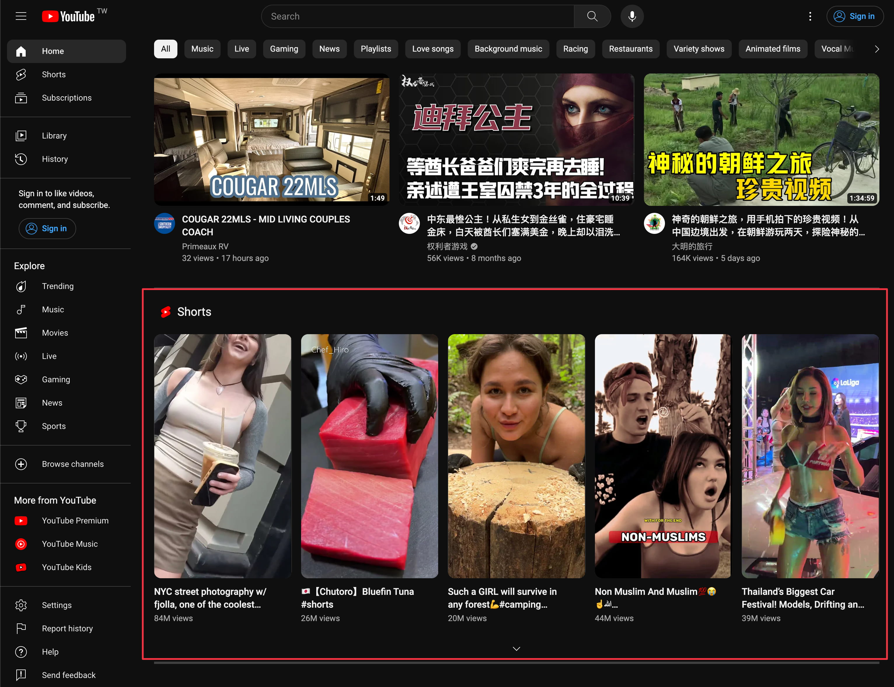
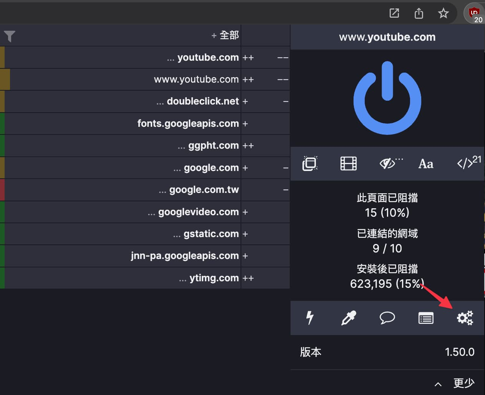
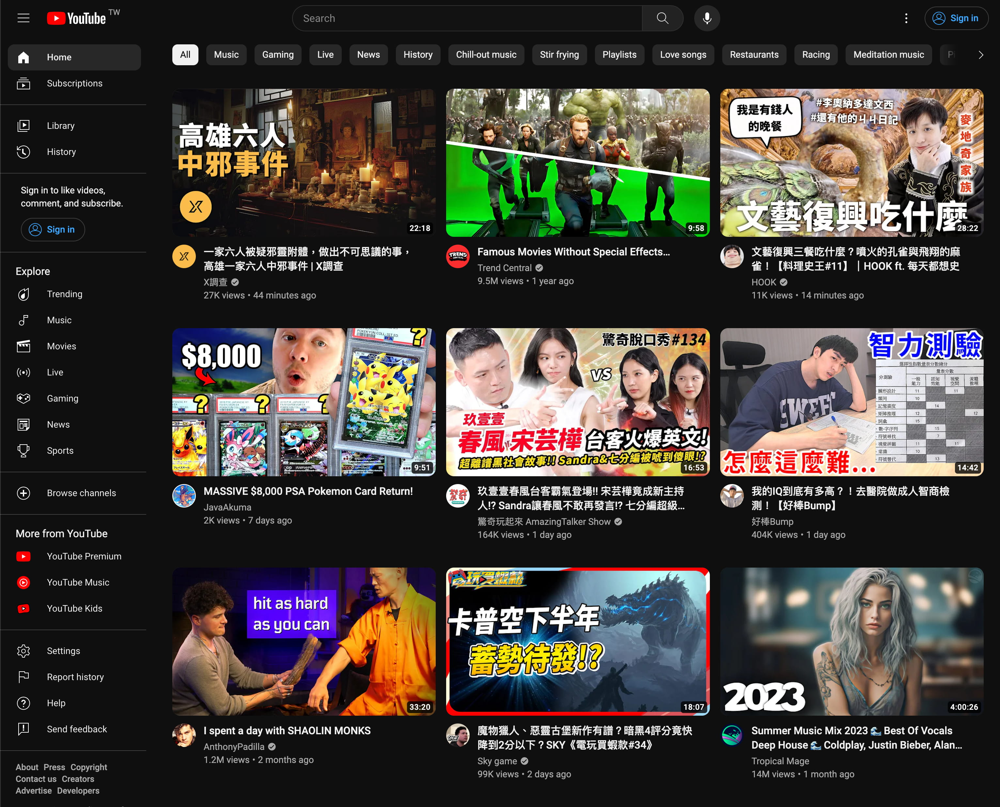

[uBlock Origin](https://chrome.google.com/webstore/detail/ublock-origin/cjpalhdlnbpafiamejdnhcphjbkeiagm?utm_source=app-launcher) 已經是裝 Chrome 系瀏覽器必備擴充程式

預設功能已經可以阻擋多種網頁廣告和 youtube 影片廣告

還可以安裝第三方提供的 AdBlock list

像是 [EasyList](https://easylist.to/)、[AdGuard Filters](https://adguard.com/kb/general/ad-filtering/adguard-filters/)...等

更加分的是可以「自訂靜態過濾規格」隱藏特定網頁不想看到的區塊

如現在 youtube 首頁也有短影片



從工具列點 uBlock 圖示右下角打開控制台到「自訂靜態過濾規格」



輸入下面規則可以隱藏首頁 Shorts 區塊

```txt
www.youtube.com##ytd-rich-section-renderer.ytd-rich-grid-renderer:has-text(shorts)
```

再輸入下面規則可以隱藏 Youtube 導航 Shorts 入口

```txt
www.youtube.com##ytd-guide-entry-renderer.ytd-guide-section-renderer:has(a[title="Shorts"])
www.youtube.com##ytd-mini-guide-entry-renderer.ytd-mini-guide-renderer:has(a[title="Shorts"])
```

這下 Youtube 首頁清爽多了



更多自訂規則說明參考 [Procedural cosmetic filters · gorhill/uBlock Wiki](https://github.com/gorhill/uBlock/wiki/Procedural-cosmetic-filters)
